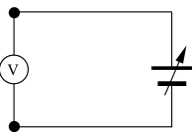

# Grundlagen
## Analog-Technik und Digital-Technik

In der Schwachstromelektronik werden heute die beiden Bereiche 
Analog-Technik und Digital-Technik unterschieden.

Ein einfaches Beispiel für diese beiden Begriffe stellt ein 
gewöhnlicher Spannungsmesser dar. Wenn man das Messgerät wie in 
*Abb. 1* an eine regelbare Spannungsquelle anschließt, so vergrößert 
sich der Zeigerausschlag mit zunehmender Spannung. Dabei wird einem 
bestimmten Spannungswert genau eine Zeigerstellung zugeordnet. Dieser 
gleichmäßige Anstieg oder Abfall des Zeigers wird **analoges Verhalten**
genannt.

Dabei ist jeder Zwischenwert der Spannung innerhalb des Messbereiches 
des Spannungsgerätes möglich. Der Ausschlag des Messgerätes entspricht
dabei der angelegten Spannung, oder anders ausgedrückt: die angelegte 
Spannung ist analog zum Zeigerausschlag.

*Abb. 2* zeigt ein typisches Diagramm für analoges Verhalten. Hier ist 
der Zeigerausschlag des Messgerätes in Abhängigkeit der Zeit t 
dargestellt. Es ist deutlich zu sehen, dass jeder beliebige 
Zwischenwert des Ausschlags eingestellt werden kann.

Bei der **Digital-Technik** dagegen wird die Information, die bei der 
Analog-Technik durch den Kurvenverlauf gegeben ist (Zeigerausschlag), 
durch das Ablesen auf der Skala bestimmt. Man ordnet eben jedem 
Zeigerstand einen bestimmten Spannungswert zu. Das ist bei fast allen 
Messgeräten durch die Skala von vornherein schon gegeben. Indem man 
nun die Skalenstriche abzählt, setzt man das analoge Signal 
(Ausschlag des Zeigers) in ein digitales Signal (Anzahl der Striche) 
um. 

**Dabei hat die Digital-Technik gegenüber der Analog-Technik einen großen 
Vorteil**. Während bei analogen Schaltungen der Spannungsbereich meist 
genau stimmen muss, braucht man in digitalen Schaltungen nur den 
richtigen Spannungsbereich einzuhalten. Dies bringt eine **erhöhte 
Stabilität** der digitalen Schaltungen mit sich.

Die beiden Spannungsbereiche, die in der Digital-Technik verwendet 
werden, heißen `L-Bereich` (von engl.: low = niedrig) und `H-Bereich` 
(von engl.: high = hoch). Hier werden für die Beispiele eine 
Versorgungsspannung `Uv = 5V` und die beiden Spannungsbereiche mit 
`0V bis +0,5V` für `L` (low) und `+2,5V bis +5V` für `H` (high) festgelegt, 
da diese Spannungsbereiche außerdem gerade für TTL-Schaltungen 
(TTL = Transistor-Transistor-Logik) oft benötigt werden.

In der mathematischen Beschreibung von digitalen Schaltungen wird der 
L-Bereich mit 0 und der H-Bereich mit 1 beschrieben. Dies ist unter 
anderem für Wahrheitstabellen und *KV-Tafeln*, die in anderen Kapiteln 
zur Anwendung kommen, sehr von Vorteil.

## Das Dualsystem

In den digitalen Schaltungen mit seinen zwei Bereichen H und L wird
das Dualsystem für die Beschreibung mathematischer Zusammenhänge
angewendet. Dabei werden nur zwei Zahlen benötigt, nämlich 1 und 0.
Eine Verdeutlichung des Dualsystems ist am einfachsten durch eine
Gegenüberstellung mit unserem üblichen Dezimalsystem zu erreichen:

| Dezimalsystem	   |    Dualsystem  |
|:------------------:|:----------------|
|	0              |   0
|	1              |   1
|	2              |   10
|	3              |   11
|	4              |   100
|	5              |   101
|	6              |   110
|	7              |   111
|	8              |   1000
|	9              |   1001
|	10              |  1010
|	11              |  1011

Dabei spricht man die duale Zahl `1001` nicht etwa <del>Eintausendeins</del>,
sondern man spricht die Zahlen einzeln von links beginnend,
also ***Eins, Null, Null, Eins***.

Durch diese Darstellung können digitale Schaltungen (z.B. Zähler)
sehr einfach und durchsichtig dargestellt werden.

## Anmerkung zur Elektronik

Alle hier behandelten Schaltungen entsprechen der sog. **Positiv-Logik**.
Das heißt, dass der H-Bereich eine positive Spannung sein muss.

*(Es gibt auch eine Negativ-Logik, die aber in der Technik kaum eine
Bedeutung hat.)*

Weiterhin gilt ein **offener Eingang** (nicht angeschlossener Eingang)
**immer als Wert 1** (entspr. H). Dies ist durch die Bauweise der ICs
(Integrierte Schaltungen) bedingt, die intern immer den Wert 1 an
einen Ausgang legen, wenn dieser nicht angeschlossen ist. Das bringt
vor allem beim Zusammenschalten mehrerer Verknüpfungsschaltungen
enorme Vorteile.

Der **Masseanschluss** bei digitalen Schaltungen hat **immer den Wert 0**.
Dies entspricht bei der Stromversorgung dem Minuspol. Der Wert 1 ist
also der Pluspol der Spannungsquelle. Falls Messungen mit einem
Spannungsmessgerät oder gar Oszilloskop gemacht werden, ist daher
der Massepunkt immer der negative Pol der Spannungsquelle. Die
kapazitive Last für digitale Schaltungen sollte 100 pF nicht
überschreiten, damit die Funktion gewährleistet ist und eine
Überlast der Ausgänge durch zu hohe Auf- bzw. Entladeströme
vermieden wird. Sind größere Kondensatoren zur Signalverzögerung
erforderlich, so ist ein Vorwiderstand vorzusehen.

Der Ausgangsstrom von TTL-Schaltungen ist sehr gering, meist bei 20 mA.
Das reicht wohl für den Betrieb einer Kontroll-LED (Licht Emittierende
Diode = Leuchtdiode), doch ist darauf zu achten, dass der Ausgang
nicht überlastet wird. Notfalls muss ein Schaltverstärker dem Ausgang
folgen, der das Ausgangssignal verstärkt. Bei manchen IC’s jedoch ist
speziell für LED-Betrieb ein Treiber vorhanden, der einen Anschluss
von mehr als einer LED erlaubt (z.B. beim 7-Segment-Decoder). Es ist
ratsam, sich deshalb in einem Datenbuch über diesen Sachverhalt zu
informieren.

