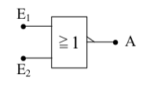
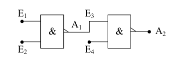
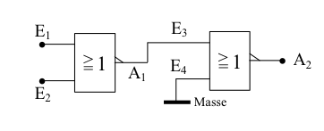

# Einführung
Logische Verknüpfungsschaltungen sind das Grundgerüst der digitalen 
Technik. Mit Hilfe der 5 hier aufgeführten Verknüpfungsschaltungen,
die auch Gatter genannt werden, lassen sich nun alle anderen 
Verknüpfungsschaltungen realisieren.

Die Wahrheitstabelle, oder auch Logik-Tafel, die bei jeder 
Verknüpfungsschaltung mit aufgeführt wird, gibt an, welches Signal am 
Ausgang anliegt, nachdem die Eingänge in einer bestimmten Weise 
angeschlossen wurden. Dabei werden alle möglichen 
Anschlusskombinationen durchgespielt.


##  AND-Gatter

Die Boolesche Funktionsgleichung (mathematische Gleichung) für das
AND-Gatter lautet:


```
     A = E1 ∧ E2	   	(sprich: “E1 und E2“)
```

**Das bedeutet, dass  nur dann den Wert 1 hat**, wenn die Eingänge
`E1` und `E2` den Wert `1` haben.


**In allen anderen Fällen** hat der Ausgang `A` den Wert `0`.  Anhand
der Logik-Tafel ist dies leicht zu erkennen. In der Zeile, in der `A`
den Wert 1 hat, haben die beiden Eingänge ebenfalls den Wert 1.


### Logiktabelle

|    E1    |    E2    |     A    |
|:--------:|:--------:|:--------:|
| 0        |      0   |     0    |
| 0        |      1   |     0    |
| 1        |      0   |     0    |
| 1        |      1   |    **1**   |


### Symbol


Hier ist die einfachste `UND-Verknüpfung` gewählt worden, nämlich die
mit 2 Eingängen. Tatsächlich gibt es jedoch auch AND-Gatter mit mehr
als zwei Eingängen. Die mathematische Logik bleibt dabei aber
gleich:

    Nur wenn alle Eingänge den Wert 1 haben, hat der Ausgang
    ebenfalls den Wert 1.

Die UND-Verknüpfung wird auch als **Konjunktion** bezeichnet, was so
viel heißt wie **Bindung**.


##  OR-Gatter

Hier heißt die mathematischer Gleichung:


```
     A = E1 ∨ E2		(sprich: “E1 oder E2“)

```

Dabei hat A dann den Wert 1, wenn `E1` **oder** `E2` **oder** `beide` (!) Eingänge den Wert 1 haben.

Dieses Verhalten
unterscheidet sich von dem normalen Sprachgebrauch
des Wortes *oder*. Hier bedeutet es: A hat nur dann
den Wert 0, wenn beide Eingänge den Wert 0 haben.
Sonst hat der Ausgang den Wert 1.


### Logiktabelle

|    E1    |    E2    |     A    |
|:--------:|:--------:|:--------:|
| 0        |      0   |    0     |
| 0        |      1   |  **1**   |
| 1        |      0   |  **1**   |
| 1        |      1   |  **1**   |


### Symbol


Die ODER-Verknüpfung gibt es ebenfalls mit mehr als zwei Eingängen, wobei sich die mathematischer Logik wie beim AND-Gatter nicht ändert. Eine andere Bezeichnung für das OR-Gatter ist die **Disjunktion**, das heißt **Trennung**.


##  Inverter

Das Schaltsymbol des Inverters ist unten abgebildet. Dabei lässt sich die mathematische Logik durch folgende Gleichung darstellen:


```
     A = ¬E (sprich “E komplementär“ oder “E negiert“).
```


### Logiktabelle

|    E1    |     A    |
|:--------:|:--------:|
| 0        |  **1**   |
| 1        |    0     |


### Symbol


Ein anderer Begriff für den Inverter ist die *Negation*. Indem man nun das AND-Gatter und das OR-Gatter negiert, erhält man zwei weitere wichtige Verknüpfungsschaltungen.


##  NAND-Gatter

Gebildet aus den englischen Worten **not and**, also **nicht und**. Daraus lässt sich bereits schließen, dass die Verknüpfung negiert sein muss. Die mathematische Gleichung bestätigt dies:


```
     A = ¬(E1 ∧ E2) (sprich: “E1 und E2 negiert“)


```

Der Ausgang `A` hat immer den Wert 1, außer wenn beide Eingänge den Wert 1 haben. Anhand der Logik-Tafel lässt sich auch erkennen, dass die NAND-Funktion an ihrem Ausgang genau das entgegengesetzte Signal hat wie das AND-Gatter.


### Logiktabelle

|    E1    |    E2    |     A    |
|:--------:|:--------:|:--------:|
| 0        |      0   |  **1**   |
| 0        |      1   |  **1**   |
| 1        |      0   |  **1**   |
| 1        |      1   |  **0**   |


### Symbol


##  NOR-Gatter

Gebildet aus den englischen Wörtern **not or**, was übersetzt **nicht oder** heißt. Es handelt sich also wiederum um eine Negation, nämlich die der OR-Verknüpfung. Die mathematische Gleichung lautet:


```
     A = ¬(E1 ∨ E2) (sprich: “E1 oder E2 negiert“)

```

Bei dieser Verknüpfungsschaltung hat der Ausgang `A` den Wert 1, wenn beide Eingänge den Wert 0 haben. In allen anderen Fällen hat der Ausgang den Wert 0.


### Logiktabelle

|    E1    |    E2    |     A    |
|:--------:|:--------:|:--------:|
| 0        |      0   |  **1**   |
| 0        |      1   |  **0**   |
| 1        |      0   |  **0**   |
| 1        |      1   |  **0**   |


### Symbol




Da diese beiden letzten Gatter sehr häufig vorkommen, haben sie ein eigenes Schaltsymbol. Außerdem sind sie für den Praktiker sehr interessant, da sie gegenüber den *UND-* bzw. *ODER-Gattern* meist erheblich billiger sind. Deshalb nimmt man häufig zwei *NAND-Gatter* um ein *UND-Gatter* billig aufzubauen, oder zwei NOR-Gatter für ein OR-Gatter. Die dafür notwendigen Schaltungen werden im Folgenden erklärt.



Bei dieser Schaltung hat der Ausgang `A1` nur dann den Wert 0, wenn beide Eingänge, also `E1` und `E2` den Wert 1 haben. Der offene (nicht angeschlossene) Eingang `E4` hat generell den Wert 1. Um aber am Ausgang A2 den Wert 1 zu erreichen, muss deswegen `E3` und somit am Ausgang `A1` der Wert 0 anliegen. Dies wird, wie oben schon beschrieben, nur dadurch erreicht, dass man den Eingängen `E1` und `E2` den Wert 1 zuordnet.


Mathematisch ausgedrückt bedeutet dies:


    A1 = ¬(E1 ∧ E2)

    A2 = ¬A1 = ¬(¬(E1 ∧ E2))

`¬(¬(E1 ∧ E2))` ist aber nichts anderes als `E1 ∧ E2`; somit gilt die Funktionsgleichung der normalen UND-Verknüpfung:

    A2 = E1 ∧ E2

Dies beweist, dass die obige Schaltung einer normalen UND-Verknüpfung entspricht.




Die Logik dieser Schaltung ist ähnlich der Vorherigen. Der Ausgang `A2` hat nur dann den Wert 0, wenn `E3` den Wert 1 hat. E4 ist durch den Masseanschluss sowieso immer auf 0. Der Wert 1 an `E3` und somit an `A1` wird aber nur erreicht, indem man `E1` und `E2` den Wert 0 zuordnet. In allen anderen Fällen hat `A1` den Wert 0 und damit `A2` den Wert 1. Dies wiederum entspricht genau der OR-Verknüpfung.

Hier der mathematische Beweis:


    A1 = ¬(E1 ∨ E2)

    A2 = ¬A1 = ¬(¬(E1 ∨ E2)) = E1 ∨ E2

Mit diesen nun beschriebenen **5 Grundschaltungen** (AND-, NAND-, OR-, NOR-Gatter und Inverter) lassen sich **alle** anderen logischen Verknüpfungsschaltungen realisieren.

Man muss nur die gewünschten Elemente zusammenschalten. Den mathematischen Hintergrund für die Kombination der Gatter liefert die Boolesche Algebra. Die Grundfunktionen sind bei der Erklärung der Schaltungen mit angegeben.


##  EX-OR-Gatter (Exklusiv-ODER)

Eine Variation der Zusammenschaltung der 5 Grundgatter ist das *Exklusiv-ODER*. Im Gegensatz zur ODER-Verknüpfung tritt am Ausgang nicht der Wert 1 auf, wenn beide Eingänge den Wert 1 haben. Diese Funktion entspricht jetzt dem *oder* wie es im normalen Sprachgebrauch verwendet wird. Das heißt, dass am Ausgang der Wert 1 vorliegt, wenn **entwedder `E1` oder `E2`** den Wert 1 haben. Sobald `E1` und `E2` den gleichen Wert haben, liegt am Ausgang A der Wert 0.


### Logiktabelle

|    E1    |    E2    |     A    |
|:--------:|:--------:|:--------:|
| 0        |      0   |  **0**   |
| 0        |      1   |  **1**   |
| 1        |      0   |  **1**   |
| 1        |      1   |  **0**   |


### Symbol


Da diese Verknüpfungsschaltung sehr häufig vorkommt, hat auch sie ihr eigenes Schaltsymbol. Sie kann aber auch durch die Zusammenschaltung von 2 Invertern, 2 AND-Gattern und einem NOR-Gatter aufgebaut werden. Die mathematische Funktion lautet:

    A = (¬E1 ∧ E2) ∨ (E1 ∧ ¬E2


Nun zum Schaltbild des Exklusiv-ODER. Ein Praktiker kann schon anhand der mathematischen Gleichung das Schaltbild zeichnen. Man muss dabei nur genau die Gleichung in die Schaltsymbole der logischen Verknüpfung umwandeln.


Bei dieser Schaltung wollen wir nun einmal einen anderen Weg gehen, der sich vor allem bei komplexen und komplizierteren Schaltungen als sehr einfach herausstellt. Dabei wird an die beiden Eingänge `E1` und `E2` jede mögliche Eingangskombination gelegt und bis zum Ausgang `A` *durchgespielt*. Im vorliegenden Fall sind das genau 4 Kombinationen.

1. An E1 und E2 liegt jeweils der Wert 0. Das obere AND-Gatter hat also am Eingang den Wert 0 von E1 und den Wert 1 vom invertierten E2. Das ergibt einen Zwischenwert G1 = 0. Das untere AND-Gatter hat ebenfalls den Wert 0 (von E2) und den Wert 1 (invertiertes E1) und somit ebenfalls den Zwischenwert G2 = 0. Diese beiden Zwischenwerte liegen nun an einem OR-GATTER, das dadurch am Ausgang den Wert 0 hat. Damit ist die erste Zeile der Logik-Tafel schon festgelegt.

1. Nun legt man an E1 den Wert 0 und an E2 den Wert 1. Da E2 invertiert an das obere AND-Gatter gelangt und E1 von vorneherein 0 ist, erscheint am oberen Zwischenausgang G1 der Wert 0. Beim unteren AND-Gatter sind dagegen beide Eingänge auf dem Wert 1, da E1 invertiert wird und E2 den Wert 1 hat. Das ergibt am Zwischenausgang G2 den Wert 1. Am OR-Gatter liegt also nun einmal der Wert 0 (G1) und einmal der Wert 1 (G2). Der Ausgang A hat somit den Wert 1.

1. Wenn man nun an den Eingang E1 den Wert 1 und an E2 den Wert 0 legt, so läuft die Logik genau den gleichen Weg. Nur liegen dabei die Werte die vorher am oberen AND-Gatter lagen nun am unteren und umgekehrt. Am Ausgang erscheint deshalb wie unter 2. der Wert.

1. Die letzte Kombinationsmöglichkeit ist nun die, dass beide Eingänge E1 und E2 den Wert 1 bekommen. Durch die Invertierung von E2 am oberen und E1 am unteren AND-Gatter haben die Zwischenausgänge G1 und G2 die gleichen Werte, nämlich 0. Eine Parallele dazu ist die erste Kombination. Am Ausgang A erscheint deshalb der Wert 0.


##  EX-NOR-Gatter

Eine Variation des EX-OR-Gatters ist diese Schaltung. Dabei wird nur der Ausgang A der oberen Schaltung invertiert.


### Logiktabelle

|    E1    |    E2    |     A    |
|:--------:|:--------:|:--------:|
| 0        |      0   |  **1**   |
| 0        |      1   |  **0**   |
| 1        |      0   |  **0**   |
| 1        |      1   |  **1**   |


### Symbol


## Schaltung


