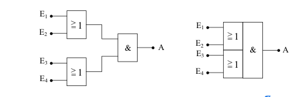
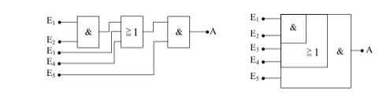
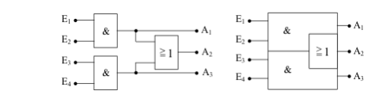

#  Gatter mit mehreren Eingängen

Oftmals ist es nötig, Verknüpfungsschaltungen mit 3 oder 4 Eingängen 
in eine Schaltung zu integrieren. Haben Sie diese Gatter nicht zur 
Hand, so kann man sie mit den unten abgebildeten Schaltungen aufbauen.

##  AND mit 3 Eingängen aus 4 NAND

Zuerst die AND-Verknüpfung mit 3 Eingängen. Die folgende Tabelle zeigt, dass die abgebildete Schaltung einem AND-Gatter mit 3 Eingängen entspricht. Eingezeichnet sind auch die Zwischenausgänge `Z1`, `Z2` und `Z3`.

|    E1  |  E2  | E3  |  Z1   |  Z2  | Z3  |    A    |
|:------:|:----:|:---:|:-----:|:----:|:---:|:-------:|
| 0      |  0   |  0  |    1  |   0  |  1  | **0**   |
| 0      |  0   |  1  |    1  |   0  |  1  | **0**   |
| 0      |  1   |  0  |    1  |   0  |  1  | **0**   |
| 0      |  1   |  1  |    1  |   0  |  1  | **0**   |
| 1      |  0   |  0  |    1  |   0  |  1  | **0**   |
| 1      |  0   |  1  |    1  |   0  |  1  | **0**   |
| 1      |  1   |  0  |    0  |   1  |  1  | **0**   |
| 1      |  1   |  1  |    0  |   1  |  0  | **1**   |

Nach diesem Schema lässt sich auch eine UND-Schaltung mit
4 Eingängen aus 6 NAND-Gattern aufbauen usw.

## NOR-Gatter mit 3 Eingängen aus 3 NOR-Gattern

Die folgende Logiktafel mit den Zwischenausgängen gibt auch hier wiederum Auskunft darüber, dass das Verhalten der Schaltung dem eines NOR-Gatters mit 3 Eingängen entspricht.

|    E1  |  E2  | E3  |  Z1   |  Z2  |    A    |
|:------:|:----:|:---:|:-----:|:----:|:-------:|
| 0      |  0   |  0  |    1  |   0  | **1**   |
| 0      |  0   |  1  |    1  |   0  | **0**   |
| 0      |  1   |  0  |    0  |   1  | **0**   |
| 0      |  1   |  1  |    0  |   1  | **0**   |
| 1      |  0   |  0  |    0  |   1  | **0**   |
| 1      |  0   |  1  |    0  |   1  | **0**   |
| 1      |  1   |  0  |    0  |   1  | **0**   |
| 1      |  1   |  1  |    0  |   1  | **0**   |

Auch bei dieser Schaltung lassen sich durch Hinzufügen weiterer NOR-Gatter Schaltungen erzeugen, die sich wie große NOR-Gatter mit noch mehr Eingängen verhalten.

## Kombi Schaltungen

Neben den bisher gezeigten Verknüpfungsschaltungen gibt es noch weitere Schaltsymbole für spezielle Kombinationen. Daher der Name Kombi-Schaltungen. Sie werden in dieser Form sehr häufig für Decoder und andere logische Schaltungen benötigt. Aus diesem Grunde hat man auch für sie vereinfachte Darstellungen gefunden.

## Zwei OR-Gatter, deren Ausgänge über ein AND Gatter verknüpft sind

## AND-Gatter, das mit einem OR-Gatter verknüpft ist

## AND-Gatter verknüpft mit einem OR-Gatter (3 Eingänge) und nachgeschaltetem AND-Gatter

## Zwei AND-Gatter, deren Ausgänge durch ein OR-Gatter miteinander verknüpft sind

