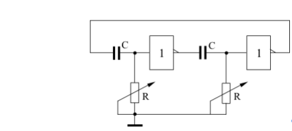
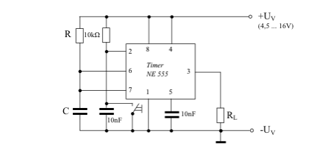

# Taktgeber
Der Taktgeber ist besonders für die im folgenden beschriebenen Flipflops, Zähler und Speicher von Nutzen. Dazu wird jeder Zeitabschnitt im Programmablauf einer digitalen Schaltung in Taktimpulse eingeteilt. Der Takt wird durch einen dauernden Wechsel von H und L, dem sogenannten Dauerimpuls, an eine Schaltung gelegt. So z.B. auch an jedem Computer. Für Versuchsschaltungen und zur genauen Verfolgung der Schaltzustände ist es von Vorteil, wenn die Taktlänge variabel ist. Man kann dadurch langsam den Programmablauf der Schaltung kontrollieren oder schnell das Verhalten prüfen.
Eine solche Schaltung für schnelle Taktimpulse ist in Abb. 20 dargestellt. Es ist ein astabiler Multivibrator mit 2 Kondensatoren die zwischen 22 nF und 1 µF liegen und mit 2 Widerständen die zweckmässigerweise wegen der Impulslänge als Drehpotentiometer verwendet werden. Man wählt am besten Drehpotentiometer in der Grössenordnung von 3,3 k. Weiterhin werden 2 Inverter verwendet.




Betrachtet man das Oszilloskopbild dieser Schaltung (s. Abb. 21), so fällt auf, dass bei den Übergängen der beiden Bereiche keine genaue senkrechten Flanken entstehen. Dies spielt jedoch bei einer digitalen Schaltung keine Rolle. Die Impulslänge kann nun durch die Drehwiderstände verändert werden. Die genaue Dauer des Impulses und der Taktlücke lässt sich durch die Gleichung t=R·C bestimmen. 

**Bei R=3k und C=100 nF erhält man also einen Impuls von `t=3·10-4 s`**

Einen besseren AMV (astabilen Multivibrator) zeigt Abb. 22. Das Herzstück dieser Schaltung ist der Präzisionstimer NE 555, der verhältnismäßig günstig ist. Der Vorteil des Timers ist vor allem die erhöhte Frequenzgenauigkeit und die genauere Impulsform der Rechteck­spannung. Dies ist deutlich am Oszilloskopbild zu erkennen. Außerdem ist die Ausgangsleistung mit etwa 200 mA deutlich höher als bei der vorherigen Schaltung. Die Impulslänge kann durch Wahl der Widerstände und des Kondensators zwischen einigen ns und mehreren Sekunden (50 s und mehr) variiert werden.


```
t1 = 0,7(RA+RB)·C

t2 = 0,7·RB·C

t1+t2 = 0,7(RA+2RB)·C

```

Nun kann es jedoch manchmal auch nötig sein, einzelne Impulse, die von Hand ausgelöst werden, an eine digitale Schaltung zu legen. Dies ist vor allem von großem Nutzen, wenn die Schaltung nach jedem Schritt kontrolliert werden soll. Nun könnte man einfach einen Taster nehmen, mit der Stromversorgung verbinden und durch das Drücken der Taste einen Impuls erzeugen. Doch leider geht das nicht so einfach. Der Grund dafür ist in Abb. 24 zu erkennen.


Bei einem einfachen Taster ist eben keinesfalls beim Drücken der Taste sofort die angelegte Spannung am Ausgang vorhanden. Vielmehr “pendelt“ der Spannungswert zwischen High und Low viele Male hin und her bevor der Spannungswert konstant bleibt. Das geschieht zwar mit einer sehr hohen Frequenz, doch sind gerade digitale Schaltungen auf sehr hohe Frequenzen (im Megahertz bis Gigahertz-Bereich) ausgelegt und reagieren damit auf diese schnellen Wechsel. Falls also ein einfacher Taster verwendet wird, ist eine sog. “Entprellung“ unbedingt erforderlich. Den Schaltplan dazu zeigt Abb. 25. Wie man sieht, ist auch diese Schaltung mit Standard-Gattern aufgebaut, nämlich zwei NAND-Gattern.


Eine weitaus bessere Schaltung für Einzelimpulse ist in Abb. 26 dargestellt. Dabei findet wieder der Timer-IC NE 555 von Texas Instruments Verwendung. Man kann nun durch die Wahl des Widerstandes R und des Kondensators C die Impulsdauer bestimmen und zwar von einigen ns bis zu mehreren Sekunden. Bei der einfachen entprellten Taste kann man zwar auch durch mehr oder weniger langes Drücken der Taste die Impulsdauer grob bestimmen, doch versagt diese Methode bei kurzen Einschaltzeiten. Außerdem ist auch hier der Ausgang höher belastbar.



## Takgeber in der Digitaltechnik
Der Takt, und somit der Taktgeber, spielen in der Digitaltechnik eine sehr große Rolle. Zum Beispiel in einer Digitaluhr, einem Zählwerk oder einem Computer.
Um nun aber nicht immer einen kompletten Taktgeber in einer Schaltung zeichnen zu müssen, hat man auch dafür ein Schaltsymbol. Abb. 28 zeigt dies mit einer kleinen Raffinesse. Wenn man nämlich an den Ausgang ein AND-Gatter schaltet und den anderen Eingang des AND-Gatters in der angegebenen Weise mit einem Takter, der an L liegt verbindet, kann die Zeit, in der die Impulse am Ausgang A liegen bestimmt werden. Impulse gelangen nur dann zum Ausgang A, wenn der Taster gedrückt ist. Vorteilhaft ist dies vor allem bei sehr kurzer Impulsdauer.
Der H-Wert kann auch bei umfangreicheren Schaltungen auf andere Weise an den unteren Eingang des AND-Gatters gelangen. Zum Beispiel durch eine weitere Verknüpfungsschaltung die dann den Wert L liefert, wenn ein Zähler einen bestimmten Stand erreicht hat. In diesem Fall sperrt das AND-Gatter den Impuls durch einen L-Wert am unteren Eingang und der Zähler kann durch das Ausbleiben von Impulsen nicht mehr weiterzählen.


