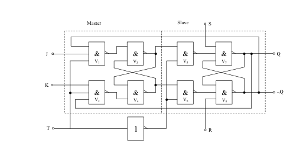
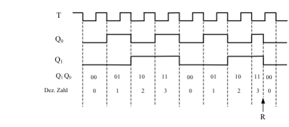
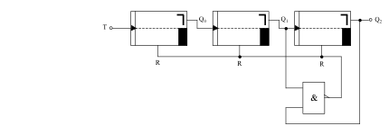
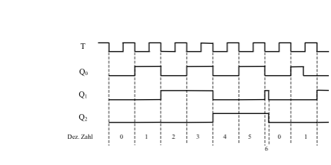

# Flipflop
Ein Flipflop (auch Flip-Flop), oft auch bistabile Kippstufe oder bistabiles Kippglied genannt, ist eine elektronische Schaltung, die zwei stabile Zustände einnehmen und damit eine Datenmenge von einem Bit über eine unbegrenzte Zeit speichern kann. Im Gegensatz zu anderen Speicherarten muss jedoch die Spannungsversorgung dauernd gewährleistet sein. Das Flipflop ist als Grundbaustein der sequentiellen Schaltungen ein unverzichtbares Bauelement der Digitaltechnik und damit fundamentaler Bestandteil vieler elektronischer Schaltungen von der Quarzuhr bis zum Mikroprozessor. Insbesondere ist es sehr häufig in bestimmten Ausführungen von Computerspeicher-Chips (statischen Speicherbausteinen) als elementarer Ein-Bit-Speicher enthalten.

## RS-Flipflop (Setzspeicher)

Dieses Bauteil ist das einfachste Speicherglied der Digitaltechnik. Es kann einen bestimmten Wert über eine gewisse Zeit speichern. Am besten lässt sich das Verhalten an der NAND-Schaltung erklären. Allerdings ist diese Schaltung nur eine Prinzipschaltung, die z.B. nicht das “Warum“ der Speicherung erklärt.

Setzt man in dieser Schaltung den S-Eingang (“Setz-Eingang“) mit dem Taster auf 0, so hat der Ausgang A den Wert 1. Wird dagegen der untere Taster betätigt und somit der R-Eingang (“Rücksetz-Eingang“) auf den Wert 0 gelegt, so erscheint am Ausgang A der Wert 0. Der komplementäre Ausgang ¬A hat immer den entgegengesetzten Wert von A. Das Wesentliche dieser Schaltung ist aber, dass durch Betätigen von z.B. Taster S der Wert 1 am Ausgang “gespeichert“ bleibt – auch nach dem Loslassen der Taste. Und zwar so lange, bis durch Betätigen des Tasters R der Ausgang auf den Wert 0 gesetzt wird. Dabei spielt es keine Rolle, ob der Taster bei S noch gedrückt ist oder nicht. Abb. 30 verdeutlicht das Verhalten der Schaltung. Abb. 31 zeigt das Schaltsymbol für RS-Flipflops.

Den Setzspeicher findet man als IC meist nicht als einzelne Schaltung. Vielmehr haben andere Flipflops wie z.B. das JK-Flipflop das RS-Flipflop integriert. Durch geeignete Beschaltung ist es aber nicht schwer, solch ein Flipflop als RS-Flipflop zu betreiben. In manchen Datenbüchern und Applikationen sind die beiden Eingänge mit `¬R` und `¬S` bezeichnet. Das bedeutet nichts anderes, als eine Unterstreichung der Tatsache, dass z.B. das Setzen nicht durch `S=1`sondern durch `S=0` erfolgt. Und das ist ja nichts anderes als `¬S=1`.
Um nun in einem Übungsaufbau den Wert am Ausgang sofort zu erkennen, empfiehlt es sich, eine Leuchtdiode (LED) dazuzuschalten. Leuchtet sie, so hat der Ausgang den Wert 1. Der komplementäre Ausgang `¬A` hat somit den Wert 0. Ist die LED dunkel, so hat `A` den Wert 0 und `¬A` den Wert 1.

## Das JK-Flipflop (Master-Slave-Flipflop)

Ein weiteres und sehr wichtiges Flipflop ist das JK-Flipflop. Mit ihm können viele Zähler und Teiler aufgebaut werden. Wie man an dem Schaltsymbol erkennt, hat auch dieses Flipflop einen Setz- und einen Rücksetzeingang. Werden diese beiden Anschlüsse verwendet, so kann man das Bauteil als gewöhnliches RS-Flipflop betreiben. Dazu sollten aber die anderen Eingänge nicht angeschlossen sein um eine Fehlschaltung am Ausgang zu vermeiden.

Das JK-Flipflop kann alternativ dazu über die beiden Eingänge J und K betrieben werden. Für diesen Fall besitzt es noch einen weiteren Eingang T, über den dem Flipflop ein Taktimpuls zugeführt werden kann.

Prinzipiell unterscheidet man zwei Arten von JK-Flipflops: Das “positiv-flankengetriggerte“ und das “negativ-flankengetriggerte“. Beim positiv-flankengetriggerten Flipflop, das in Abb. 32 dargestellt ist, erfolgt die Schaltung am Ausgang durch den ansteigenden Teil des angelegten Takt-Impulses. Das bedeutet, dass die Werte am Ausgang, die durch J und K bestimmt werden mit dem Ansteigen des Taktimpulses von L auf H ihren Wert ändern. Dargestellt ist das im Schaltsymbol durch die ansteigende Flanke eines Rechteckimpulses in der oberen rechten Ecke des Schaltsymbols.

Beim negativ-flankengetriggerten JK-Flipflop, das in der Technik hauptsächlich verwendet wird, erfolgt die Umschaltung beim Abfallen des Impulses von H auf L. Abb. 33 symbolisiert ein solches Bauteil. Das Unterscheidungsmerkmal gegenüber dem vorherigen Flipflop ist die abfallende Flanke eines Rechteckimpulses.

Wohlbemerkt sind die beiden Eingänge R und S in diesem Fall nicht angeschlossen. Sie haben nämlich Priorität, d.h. sie sind vom Takt unabhängig. Doch dazu später mehr.
Wie schon bei der Unterscheidung der beiden JK-Flipflops erwähnt wurde, ist ein Taktimpuls bei diesem Bauteil sehr wichtig. Angelegt wird er am Eingang T. Von ihm hängt es z.B. ab, wie schnell sich ein Wert am Ausgang Q oder ¬Q ändern kann. Die Logik-Tafel gibt über die Werte am Ausgang genauer Auskunft.

|  J   |   K   |   Q   |   ¬Q   |
|:----:|:-----:|:-----:|:------:|
|   0  |   1   |   **0**   |   **1**    |
|   1  |   0   |   **1**   |   **0**    |
|   0  |   0   |   **Q**   |   **¬Q**   |
|   1  |   1   |   **¬Q**  |   **Q**    |

1. Hat der J-Eingang den Wert 0 und K den Wert 1, so liegt am Ausgang Q der Wert 0. Entsprechend hat der komplementäre Ausgang ¬Q den Wert 1.

1. Wechselt nun der J-Eingang auf den Wert 1 und der K-Eingang auf den Wert 0, so hat der Ausgang Q den Wert 1 und ¬Q den Wert 0.

1. Wenn beide Eingänge den Wert 0 haben, so ändert sich das Ausgangssignal nicht, das bedeutet, dass der vorherige Wert des Ausgangs beibehalten wird.

1. Falls beide Eingänge den Wert 1 aufweisen, so dreht sich das Ausgangssignal gerade um. Sowohl Q als auch ¬Q nehmen jeweils ihren komplementären Wert an. Oder anders ausgedrückt: Q nimmt den Wert von ¬Q an und ¬Q den Wert von Q.

.

Allerdings kann sich das Ausgangssignal nur ändern, wenn ein Taktimpuls wirksam geworden ist. Um also ein Umschalten des Wertes am Ausgang zu erreichen, muss unbedingt ein Takt angelegt werden. Sobald nun bei einem negativ-flankengetriggerten Flipflop eine negative Flanke an T anliegt, stellen sich die Ausgänge Q und ¬Q entsprechend den Eingängen J und K um.
Die Eingänge R und S sind dagegen vom Taktimpuls unabhängig. Sobald z.B. der Setzeingang auf Masse gelegt wird, erscheint am Ausgang der Wert 1, auch dann, wenn gerade kein Taktimpuls wirksam wurde. Ebenso funktioniert die Schaltung wenn der Rücksetzeingang R mit Masse verbunden wird. Dann erscheint am Ausgang A der Wert 0. Sobald der R- oder der S-Eingang benutzt wird, ist die übrige Beschaltung (also T, J und K) nicht wirksam.
In Abb. 34 ist nun das Schaltverhalten eines negativ-flankengetriggerten Flipflops dargestellt. Deutlich zu sehen ist dabei, dass ein Umschalten des Signals am Ausgang nur dann erfolgen kann, wenn der Taktimpuls T gerade abfällt.
Spannungs-Diagramm (Schaltdiagramm) für ein negativ-flanken­getriggertes JK-Flipflop

Zur Verdeutlichung hier nun die Erläuterung:

1. J=0, K=1. Da R und S den Wert 1 haben, also nicht wirksam sind, kann der Takt wirksam werden. In der Logik-Tafel sieht man, dass der Ausgang Q den Wert 0 haben muss. Deshalb nimmt Q auch im Diagramm beim Abfallen der Taktflanke T den Wert 0 an.

1. J=1, K=0. Damit hat Q den Wert 1.
1. J=K=0. Am Ausgang Q erscheint der Wert 1, da laut Logik-Tafel der Wert gleich bleibt.
1. J=K=1. Nun erscheint am Ausgang das gegenteilige Signal, das zuvor an Q lag. In diesem Fall ist es der Wert 0.
1. J=0, K=1. Damit hat der Ausgang Q den Wert 0.
1. J=K=0. Das Signal am Ausgang bleibt gleich, also auf 0.
1. Bei Punkt A wird nun der Setzeingang S auf Masse gelegt. Damit nimmt der Ausgang Q sofort den Wert 1 an. Dies geschieht wie man sieht auch ohne Taktimpuls.
1. Der Setzeingang S liegt noch immer auf Masse. Somit sind die Signale von J und K nicht wirksam, wenngleich auch eine negative Taktflanke vorliegt.
1. Im Punkt B ist nun der Setzeingang S wieder auf dem Wert 1. Dagegen wird der Rücksetzeingang R auf Masse, also auf den Wert 0 gelegt. Damit nimmt der Ausgang Q sofort den Wert 0 an.
1. R ist noch immer auf Masse gelegt. Damit hat der Ausgang unabhängig von J und K den Wert 0.
1. J=0, K=1. R hat nun wieder den Wert 1, ist also genau wie S nicht wirksam. Der Taktimpuls kann also wieder wirksam werden und schaltet deshalb bei der abfallenden Taktflanke den Ausgang Q auf den Wert 0.

Zu bemerken wäre noch, dass bei nicht wirksamen Eingängen R und S zwischen den einzelnen Takt-Impulsen die Eingänge J und K jeden beliebigen Wert annehmen können ohne dass sich der Wert am Ausgang Q verändert. Sie können auch ihren Wert zwischen zwei Impulsen mehrmals wechseln. Für das Umschalten am Ausgang ist nur interessant, was zur Zeit der abfallenden Taktflanke für Signale an J und K liegen. Nur nach diesen Werten richtet sich der Wert des Ausgangs Q.
Abb. 35 zeigt die Innenschaltung des JK-Flipflops. Das Master-Slave-Flipflop besteht intern aus 2 bistabilen Multivibratoren mit gesteuerter Übernahme, die in Reihe (hintereinander) geschaltet sind. Der sogenannte Master (engl. Master = Herr, Meister) besteht aus den Verknüpfungsschaltungen V3 und V4. Die NAND-Gatter V1 und V2 bilden die dazugehörige Torschaltung. Die J- und K-Eingänge sind UND-verknüpft. Die Verknüpfungsschaltungen V5 und V6 bilden die Torschaltung des Slave (engl. Slave = Knecht, Sklave). Der Multivibrator des Slave besteht aus den Verknüpfungsschaltungen V7 und V8. Der Multivibrator verfügt noch über 2 Eingänge, die nicht über die Torschaltung laufen, also auch unabhängig vom Takt wirksam sind: L-Pegel am Setzeingang S stellt den Ausgang Q auf den Wert 1, L-Pegel am Rücksetzeingang R stellt Q wieder auf den Wert 0 zurück.

## Dualzähler

Aus dem JK-Flipflop lässt sich nun eine in der Technik oft gebrauchte Zählerschaltung realisieren. Dabei werden oft die Eingänge S und R neben den J- und K-Eingängen benutzt. Der Einfachheit halber werden hier nur die J- und K-Eingänge sowie der R-Eingang verwendet. Natürlich wird auch der Takteingang T angeschlossen.
Wenn man an ein JK-Flipflop einen Takt T anlegt, so hat der Ausgang Q0 bei jeder negativen Taktflanke eine Wertänderung, also einen dauernden Wechsel zwischen 1 und 0. Abb. 37 zeigt den zeitlichen Verlauf des Ausgangs Q0 in Abhängigkeit vom angelegten Takt T. Jetzt wird an das zweite JK-Flipflop das Ausgangssignal Q0 angeschlossen. Somit bestimmt der Ausgang des ersten Flipflops den Takt des zweiten Flipflops. Das Anschlussbild ist in Abb. 36 zu sehen.
Wie man im Spannungsdiagramm der Schaltung erkennt, hat der Ausgang Q1 die halbe Taktfrequenz wie Q0. Dies beruht wiederum darauf, dass eine Umschaltung des Flipflops nur bei einer negativen Taktflanke stattfindet. Die Schaltzustände der beiden Flipflops entsprechen, wie unter dem Diagramm aufgezählt, dem dualen Zählerstand. Der Zähler kann also nur bis zur Zahl 11 des Dualsystems zählen. Das entspricht der dezimalen Zahl 3. Danach kehrt er automatisch wieder zur Anfangszahl 00 zurück.

Wenn nun der Rücksetzeingang R, der oftmals auch Reset-Eingang genannt wird, auf Masse gelegt wird, erscheint auf jeden Fall der Wert 0 an beiden Ausgängen. Dabei ist der Takt nicht von Bedeutung, ebenso die Schaltzustände der beiden Ausgänge Q0 und Q1. Im folgenden Diagramm wird kurz nach dem zweiten Erscheinen der Zahl 11 (dual) der Reset-Eingang aktiviert. Man sieht, dass die beiden Ausgänge sofort den Wert 0 annehmen, obwohl keine negative Flanke vorliegt. Das wurde ja bereits im letzten Abschnitt näher erläutert. Dieser Sachverhalt wird nun bei Zählern angewandt, die bis zu einer bestimmten Zahl zählen sollen, die durch eine einfache Aneinanderreihung von Flipflops nicht erreicht wird. Beispielsweise könnte man mit der in Abb. 36 dargestellten Schaltung einen Zähler bauen, der nach der Zahl 2, also dual 10, auf 0 zurückspringt. Genaueres darüber wird im nächsten Abschnitt behandelt.

## Dualzähler für beliebige Zahlenreihen

Der Dualzähler des vorherigen Abschnittes konnte nur Dualzahlen eines bestimmten Grades durchzählen. Beispielsweise von 00 bis 11 (entspricht dez. 3) oder bei einer Erweiterung der Schaltung durch zwei weitere JK-Flipflops von 0000 bis 1111 (entspricht dez. 15). Abhilfe gibt es dabei nur durch die Rücksetzung von Hand, das bedeutet den Rücksetzeingang R mit Hilfe eines Schalters auf Masse zu legen. Durch geeignete Verwendung der besprochenen Verknüpfungsschaltungen lässt sich nun der Rücksetzvorgang automatisch bewerkstelligen. Man muss nur die geeigneten Gatter zusammenschalten, die zu einem bestimmten Zeitpunkt den Zähler wieder auf Null zurücksetzt. Bei Zählern mit zwei oder drei JK-Flipflops ist das kein Problem. Selbst bei umfangreicheren Zählern gibt es leichte, sofort durchschaubare Rückstellschaltungen.
Als Beispiel wählen wir einen Zähler, der durch drei Flipflops aufgebaut ist. Das Schaltbild ist in Abb. 38 dargestellt. Dieser Zähler hat jedoch eine automatische Rückstellung bei der Zahl 110. Dies entspricht der dezimalen Zahl 6.

Wichtig ist die Zahl 6 in diesem Zähler nur für die Rückstellung. In Abb. 39 wurde die Zeitspanne für die Zahl 6 zur besseren Verständlichkeit übertrieben dargestellt. Tatsächlich erscheint diese Zahl so kurz, dass sie für den Zählvorgang keine Bedeutung hat. Es handelt sich hier also um einen Zähler von 0 bis 5. Diese Reihe wird ganz normal durchlaufen. Sobald aber der Zähler am Ausgang Q1 und Q2 gleichzeitig den Wert 1 hat, wird durch das NAND-Gatter der Reset-Eingang aller JK-Flipflops auf 0 gelegt. Der Zähler beginnt erneut von 0 an zu zählen.

Es ist also wichtig, dass bei einem beliebigen Zähler der Rücksetzvorgang mit der nächsthöheren Ziffer des eigentlichen Zählumfangs aktiviert wird. Wenn z.B. ein Zähler bis 18 zählen soll, so muss der Rücksetzeingang durch eine geeignete Verknüpfungsschaltung für die Zahl 19 auf den Wert 0 gelegt werden.

Der Rücksetzeingang bleibt nun so lange auf dem Wert 0, wie in unserem Beispiel Q1 und Q2 den Wert 1 haben. Da aber in wenigen ns der Rücksetzvorgang beendet ist (R hat Priorität), kann die nächste negative Taktflanke für das Umschalten des ersten Flipflops wirksam werden. Somit erscheint nach der dezimalen Zahl 0 (durch den Rücksetzvorgang) im nächsten Takt die 1. Problematisch wird diese Art der Rücksetzung nur bei sehr hohen Taktfrequenzen, oder bei sehr empfindlichen Schaltungen, die bei diesem kurzen Erscheinen der höheren Zahl “umkippen“ können. In diesem Fall muss man sich mit einer anderen Art der Rücksetzung behelfen. Meist genügt jedoch diese Art der Rückstellung. Die Impulsdauer sollte jedoch bei TTL-Schaltungen nicht unter 18 ns liegen, da diese Zeit zum Umschalten benötigt wird.

## D-Flipflop (Datenspeicher)

Das D-Flipflop ist ein einfaches Datenspeicherglied. Es kann einen bestimmten Wert abhängig vom Takt T und den Eingängen R und S speichern. Dabei haben die beiden letztgenannten Eingänge wie auch beim JK-Flipflop Priorität. Das bedeutet, dass das Flipflop unabhängig vom Takt einen gewünschten Wert annehmen kann, falls der Setz- bzw. Rücksetzeingang aktiviert wird. Sind diese beiden Eingänge jedoch auf den Wert 1 gesetzt (also nicht aktiv), so erfolgt bei jeder negativen Takt-Flanke eine Übernahme des Dateneingangs D an den Ausgang Q. Der komplementäre Ausgang ¬Q hat auch hier wieder den entgegengesetzten Wert von Q. Das Verhalten von D in Abhängigkeit vom Takt T und den Eingängen S und R zeigt das abgebildete Spannungsdiagramm.

Die Industrie bietet D-Flipflops schon fertig aufgebaut als ICs an. Haben Sie diese jedoch nicht zur Hand, so kann man mit Hilfe eines JK-Flipflops einen solchen Datenspeicher aufbauen. Dazu ist es notwendig den K-Eingang über einen Inverter an den J-Eingang anzuschließen. An K liegt also ¬J. Wird nun an J der Wert der gewünschten Daten gelegt, so übernimmt das Flipflop bei der nächsten negativen Taktflanke diesen Wert auf den Ausgang Q. Ist z.B. das Flipflop auf dem Wert Q=0 und hat der Dateneingang den Wert D=1, so wechselt nach einer negativen Taktflanke der Ausgang Q seinen Wert von 0 auf 1. Dieser Wert wird so lange gespeichert, bis über den Takt T und einen neuen Wert an D der Zustand von Q geändert wird. Natürlich wäre eine Änderung auch durch eine Aktivierung von S oder R möglich.

Ein wichtiges Anwendungsbeispiel eines D-Flipflops ist das Schiebe­register. Dieses Bauteil ist in einem eigenen Kapitel noch genauer erklärt.
