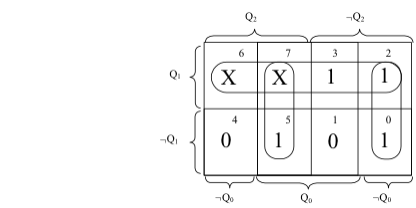
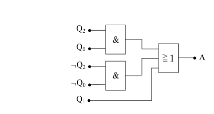
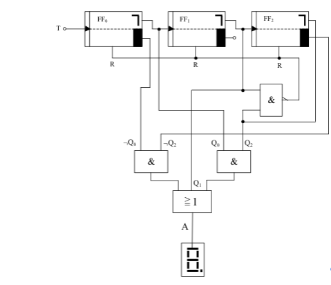
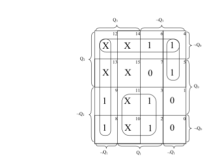
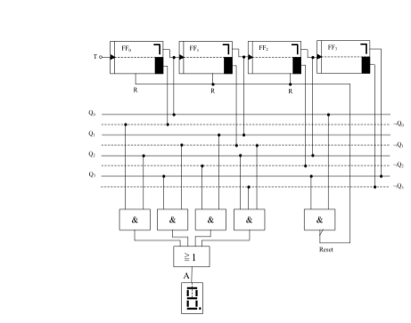

# KV-Tafel

**Um bei komplizierten Rücksetzbedingungen oder bei Ansteuerungen von LEDs und Siebensegmentanzeigen eine möglichst einfache Kombination von Verknüpfungsschaltungen zu erreichen, bedient man sich meist der sogenannten KV-Tafeln. 

**Es ist eine systematische Methode** bei der ein bestimmtes Schema die Erkennung der benötigten Verknüpfungs­schaltungen erleichtert. Entwickelt wurde es von Karnaugh und Veitch. Bei dem Verfahren werden die Variablen in rechteckigen Feldern der KV-Tafel dargestellt.

### Ein Beispiel

Der Ausgang A soll ein Segment einer 7-Segment-Anzeige ansteuern. Gewählt wurde das oberste waagerechte Segment. Dabei wählen wir den Zähler von vorher, der von 0 bis 5 zählt. Der Ausgang A muss bei 0, 2, 3 und 5 den Wert 1 haben, da bei diesen Zahlen das Segment leuchten muss.

|    Q2  |  Q1    |  Q0    |   A    |   Dez Zahl  |
|:------:|:------:|:------:|:------:|:-----------:|
|     0  |   0    |   0    |   1    |       0     |
|     0  |   0    |   1    |   0    |       1     |
|     0  |   1    |   0    |   1    |       2     |
|     0  |   1    |   1    |   1    |       3     |
|     1  |   0    |   0    |   0    |       4     |
|     1  |   0    |   1    |   1    |       5     |

Durch diese Logik-Tafel ist nun der Zusammenhang der Dualzahlen (Q2Q1Q0) und dem Anschluss A des Segments gegeben. Es soll eine Decoderschaltung gefunden werden, die das Segment nur bei den dafür bestimmten Zahlen zum Leuchten bringt.

Nun werden zuerst so viele quadratische Felder aufgezeichnet, wie der Zähler im Höchstfall erreichen kann. Das wäre in unserem Fall mit 3 JK-Flipflops die Ziffern 0 bis 7, also 8 Zahlen. Bei Zählern mit 4 Flipflops wären es 16 usw.

Danach werden die Felder in sich überlappende Bereiche unterteilt. Die komplementären Ausgänge ¬Q2, ¬Q1, ¬Q0 werden dabei ebenfalls berücksichtigt. Nun werden die Werte 1 für A in das Diagramm eingetragen. Die kleine Ziffer im rechten oberen Eck ist die dezimale Zahl dieses Feldes. Als Beispiel der Wert 1 für die dez. Zahl 0 (¬Q0, ¬Q1, ¬Q2) in die linke untere Ecke. Man nimmt immer die “Einserausgänge“ für die Bestimmung des Feldes. Bei der Zahl 000 des dualen Systems muss also jedes Mal der komplementäre Ausgang (¬Q2, ¬Q1, ¬Q0) genommen werden, da diese den Wert 1 haben. Somit wird die dezimale Zahl 0 in das obere rechte Eck des Feldes mit den Koordinaten ¬Q2, ¬Q1, ¬Q0 geschrieben und der Wert, den der Ausgang A bei dieser Zahl hat in dem Kästchen vermerkt. Bei der dualen Zahl 101 wäre also das Fach mit den Koordinaten Q2, ¬Q1, Q0 gemeint.

Mit diesem Schema wird nun das ganze Diagramm ausgefüllt. Die Felder, die danach noch frei sind, werden mit einem “Kreuz“ versehen, da sie ja beim Zählvorgang nicht vorkommen. Bei ihnen ist es also gleichgültig, ob sie nun den Wert 1 oder 0 haben.
Nun werden die “Einser“ in 2er oder 4er Gruppen zusammengefasst. Allerdings darf eine Zusammenfassung nicht diagonal erfolgen, wohl aber über den Rand hinweg. Die einzelnen Felder einer solchen Gruppe werden in der nachfolgenden mathematischen Gleichung durch ein “und“-Zeichen verknüpft. Die einzelnen Gruppen dagegen mit einem “oder“-Zeichen.

Man erhält also nach Zusammenfassung der Felder und Gruppen die mathematische Gleichung der Form:

     A = Q1 ∨ (Q2 ∧ Q0) ∨ (¬Q0 ∧ ¬Q2)

Das Umsetzen einer solchen Formel in eine Decoderschaltung wurde ja bereits bei den Verknüpfungsschaltungen erläutert. Man hält sich dabei stur an die mathematische Formel, das heißt für ein “und“-Zeichen ein AND-Gatter und für ein “oder“-Zeichen ein OR-Gatter. Damit ergibt sich die unten abgebildete Decoderschaltung die das Segment steuert.

Der Einbau dieser Decoderschaltung erfolgt nun ganz analog. Es werden die benötigten Ausgänge der einzelnen Flipflops an die Schaltung angeschlossen und der Ausgang A an das Segment der 7-Segment-Anzeige.

**Dieses Verfahren erscheint auf den ersten Blick recht kompliziert**, ist aber bei genau schematischer **Durchführung sehr einfach und schnell** auszuführen. Bei der rein mathematischen Darstellung würde ein umfangreiches Wissen der Algebra unbedingt nötig sein. Außerdem wäre der Überblick schwer zu behalten. Deshalb wählt man, wenn irgend möglich, diese Art der Lösung. Oftmals erkennt man auch sofort, wie die Decoderschaltung aussehen muss. Dann ist natürlich diese schematische Darstellung nicht nötig.
Ein weiteres Beispiel für die Anwendung der KV-Tafel. Ein Zähler, der von 0 bis 9 zählt, soll eine 7-Segment-Anzeige steuern. Gesucht ist nun die Decoderschaltung für das mittlere waagerechte Segment. Die Abhängigkeit des Ausganges A der Decoderschaltung, die das Segment ansteuert ist wiederum in der Tabelle aufgezeigt.

|   Q3   |    Q2  |  Q1    |  Q0    |   A    |   Dez Zahl  |
|:------:|:------:|:------:|:------:|:------:|:-----------:|
|     0  |     0  |   0    |   0    |   0    |       0     |
|     0  |     0  |   0    |   1    |   0    |       1     |
|     0  |     0  |   1    |   0    |   1    |       2     |
|     0  |     0  |   1    |   1    |   1    |       3     |
|     0  |     1  |   0    |   0    |   1    |       4     |
|     0  |     1  |   0    |   1    |   1    |       5     |
|     0  |     1  |   1    |   0    |   1    |       6     |
|     0  |     1  |   1    |   1    |   0    |       7     |
|     1  |     0  |   0    |   0    |   1    |       8     |
|     1  |     0  |   0    |   1    |   1    |       9     |
|     1  |     0  |   1    |   0    |   x    |       10    |

Die Rücksetzung geschieht bei Q3 = Q1 = 1. Diese beiden Ausgänge werden durch ein AND-Gatter miteinander verknüpft, negiert und an die Rücksetzeingänge der 4 JK-Flipflops angeschlossen. Man kann genauso gut ein NAND-Gatter nehmen anstatt des AND-Gatters und der nachfolgenden Negation.

Die KV-Tafel muss nun 16 Felder haben, da insgesamt 16 Ziffern gezählt werden könnten (0 bis 15). Nun werden, genauso wie vorher die Felder in sich überlappende Zeilen und Spalten unterteilt. Dabei darf keine Zeile oder Spalte für zwei Ausgänge gleichzeitig gelten. Beispielsweise darf die erste und zweite waagerechte Spalte nicht gleichzeitig Q0 und Q2 sein, wohl darf eine Spalte Q0, die andere ¬Q0 sein, und gleichzeitig beide Spalten Q2.

Die einzelnen Felder werden nun genauso wie vorher ausgefüllt. Das bedeutet, dass zuerst die dezimalen Zahlen in die rechten oberen Ecken der Felder geschrieben werden. Dies geschieht, indem man die Ausgänge der Flipflops, die den Wert 1 haben zur Auffindung der Koordinaten zuhilfe nimmt. Beispielsweise soll das Feld für die duale Zahl 0100 (entspr. der dez. Zahl 4) aufgesucht werden. Q3, also die erste Ziffer, ist 0. Da aber ein 1-Wert benötigt wird, muss der invertierte Ausgang ¬Q3 genommen werden. Q2 ist schon 1, deshalb ist der invertierte Ausgang nicht nötig. Q1 und Q0 sind wieder 0, daher wird auch hier der invertierte Ausgang verwendet. Nun liegen schon alle Koordinaten dieses Punktes fest. Er wird im KV-Diagramm aufgesucht und mit der Zahl 4 versehen.

Als weiteres Beispiel dient die duale Zahl 0101. Dabei sind die Ausgänge Q3 und Q1 Null. Also müssen hier die invertierten Ausgänge als Koordinaten verwendet werden. Q2 und Q0 sind schon 1. Das ergibt die Feldkoordinaten ¬Q3, Q2, ¬Q1, Q0. Diese Koordinaten werden im KV-Diagramm aufgesucht und mit der Zahl 5 versehen.

Sind nun sämtliche Felder mit den dazugehörigen dezimalen Zahlen versehen, wird anhand der Tabelle der Wert A, der am Ausgang des Decoders erscheinen soll, in das dafür bestimmte Feld eingetragen. Für die Felder, die der Zähler durch die Rücksetzung nicht erreichen kann, wird ein “X“ eingetragen als Zeichen dafür, dass es gleichgültig ist, ob der Zähler in dieser Situation eine 0 oder 1 ausgibt.

Nun werden benachbarte Einser-Felder zu 2er oder 4er Gruppen zusammengefasst. Diese Zusammenfassung darf auch über den Rand hinaus und auf der anderen Seite weitergehen. Diagonal darf dagegen nicht zusammengefasst werden.
Die Koordinaten, die eine Gruppe gemeinsam hat, werden untereinander mit einem “und“-Zeichen der Booleschen Algebra zusammengefasst. Die Gruppen untereinander mit einem “oder“-Zeichen. Daraus ergibt sich die mathematische Formel:

     A = (¬Q0 ∧ Q2) ∨ (¬Q1 ∧ Q3) ∨ (Q1 ∧ ¬Q2) ∨ (¬Q1 ∧ Q2 ∧ ¬Q3)

Nun müssen nur noch die “und”-Gruppen, deren Ausgänge an ein AND-Gatter angeschlossen wurden, mit einem OR-Gatter verbunden werden. Damit ist der Decoder für das mittlere Segment der 7-Segment-Anzeige fertig.

