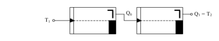
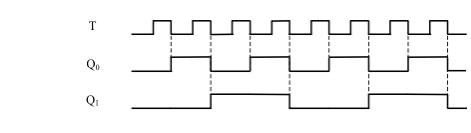

# Frequenzteiler

Für Digitaluhren, Frequenzmesser und viele weitere Schaltungen wird oft eine sehr genaue Zeitbasis verlangt. Das bedeutet, dass die Impulsdauer möglichst genau sein soll. Dies erreicht man am besten bei sehr hohen Frequenzen. Meist wird ein Quarz-Schwingkreis verwendet, der eine Schwingungszeit bis zu einigen MHz (Mega Hertz = 1 Mio. Hertz) und darüber hat. Doch können solche hohen Frequenzen nur sehr selten direkt verwendet werden. Vielmehr werden sie durch geeignete Frequenzteiler auf die benötigte Frequenz herunter gesetzt. So schwingt z.B. eine Quarzuhr mit der Frequenz 4194304 Hz. Durch Frequenzteilung wird daraus ein Impuls, der genau 1s dauert. Und diese Frequenz wird ja für eine Uhr gerade benötigt.

Der Aufbau des Teilers entspricht dem des Zählers. Die JK-Flipflops leisten uns auch hier wieder gute Dienste. Wie beim Zähler wird der Ausgang Q eines jeden Flipflops mit dem Takteingang des nächsten verbunden. Da nun eine Umschaltung am Ausgang nur durch eine negative Flanke des Eingangsimpulses erfolgen kann, wird der Eingangs-Impuls in jeder Stufe halbiert (geteilt).

Der Sachverhalt der Frequenzteilung wird am Spannungsdiagramm besonders deutlich. Man sieht den Eingangsimpuls T, der von einem Taktgenerator (z.B. Quarzoszillator) geliefert wird. Darunter die beiden Ausgänge der Flipflops.

Das Teilungsverhältnis dieser Schaltung ist 1:4, denn es sind 4 negative Taktflanken notwendig, um am Ausgang Q1 eine negative Flanke auszulösen. Am Ausgang Q0 wird eine Teilung 1:2 erreicht. Durch Hinzuschalten weiterer Flipflops ist folgende Reihe von Teilungen möglich:

    1:2, 1:4, 1:16, 1:32, 1:64, 1:128, usw.

Es handelt sich also immer um den Faktor 2. Damit lässt sich die Oszillatorfrequenz einer Digitaluhr sehr leicht berechnen. Man teilt die Frequenz so lange durch 2, bis man den gewünschten Grundwert 1 s erhält. Bei der vorher erwähnten Frequenz von 4194304 Hz wird dies erreicht, wenn man die Zahl 22 mal durch 2 teilt.
