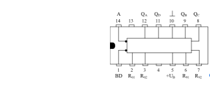
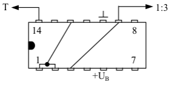
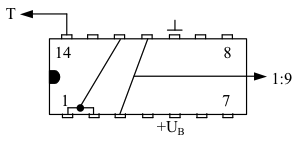
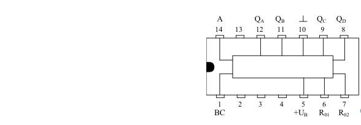
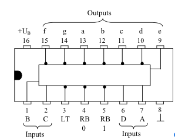
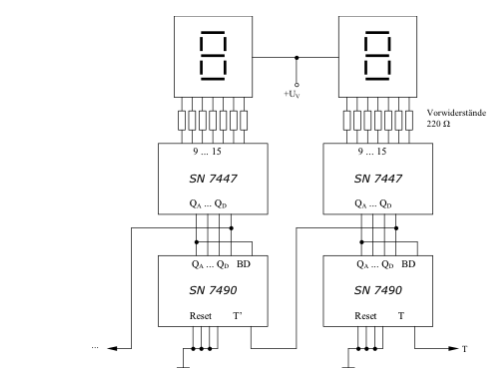
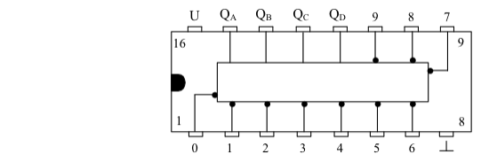

## Frequenzteiler

In der Praxis wird man nun recht selten einen Zähler mit einzelnen JK-Flipflops aufbauen. Vielmehr nimmt man Zähler bzw. Teiler, die als integrierte Schaltungen (ICs) angeboten werden. Eine solche Schaltung ist z.B. der IC “SN 7490“.
Mit dieser Schaltung lassen sich Frequenzteiler realisieren, die im folgenden beschrieben sind. Außerdem ist es ein häufig benötigter Zähler-IC, der von 0 bis 9 zählt und dann bei entsprechender Beschaltung wieder auf 0 zurück geht.

Das Prinzipschaltbild zeigt, dass auch hier 4 JK-Flipflops verwendet wurden. Hier werden zum Teil auch die Setzeingänge der Flipflops verwendet. Das bringt den Vorteil, dass Verknüpfungsschaltungen für die Rücksetzung entfallen und die Schaltung kann dadurch billiger realisiert werden.

Als Takteingang dient hier je nach Anforderung der Eingang A oder der Eingang BD, der auch in verschiedenen Datenbüchern mit B gekennzeichnet ist.

Mit den Eingängen R01 und R02 kann man eine Nullstellung “erzwingen“ indem man an beide Eingänge ein High-Signal legt. Ebenso ist es möglich mit Hilfe der beiden Eingänge R91 und R92 eine Neun-Stellung zu erzwingen. Mit einer entsprechenden Verknüpfungsschaltung ist es also möglich, jede Art von Zähler zwischen 0 und 9 aufzubauen indem man den Zähler beim gewünschten Stand wieder auf Null setzt. Für den Zähler von 0 bis 9 werden diese vier Eingänge auf Masse gelegt.

Den Anschluss des ICs zeigt die folgende Abbildung. Im Gegensatz zu den Transistoren werden allerdings sämtliche Pinbelegungsbilder mit den Anschlussbeinen nach unten gezeichnet. Man stellt also den IC auf die “Füße“ und betrachtet ihn von oben, nicht von unten!

Zur Erkennung der linken oder rechten Seite eines integrierten Schaltkreises ist bei Pin 1 bzw. Pin 14 (Pin = Anschlussbeinchen) eine Kerbe oder eine punktförmige Vertiefung angebracht. Dadurch ist die Benennung des Pins sofort zu erkennen. Eingezeichnet wird dies auch auf dem Applikationsbild (Anschlussbild).

Die Anschlüsse 4 und 13 sind bei diesem Bild nicht gekennzeichnet. Das bedeutet, dass sie keinen Anschluss zur inneren Schaltung des Zählers haben. Gewöhnlich werden solche Anschlüsse mit “NC“ gekennzeichnet, was ausgeschrieben “Non Connect“ (nicht angeschlossen) heißt.

Bei Pin 14 und 1 sieht man innerhalb des ICs den Invertierungspunkt. Das bedeutet, dass bei einem L-Impuls (hier negative Flanke, da negativflankengetriggertes Flipflop) eine Umschaltung geschehen kann.

Oftmals werden auch in Datenbüchern die Benennungsbuchstaben mit einem Komplementär-Zeichen gekennzeichnet. Das wäre in diesem Fall ¬A oder ¬BD. Die Ausgänge QA, QB, QC, QD sind Ausgänge der Flipflops und bezeichnen die Dualstelle der dualen Zahl am Ausgang. Bei der Dualzahl 1100 hat also QD und QC den Wert 1, QB und QA haben den Wert 0.

Die Spannung wird an Pin 10 (Masse) und Pin 5 (positiver Pol der Versorgungsspannung) angeschlossen.

## SN 7490 als Teiler

### Frequenzteiler 1:2
Hierbei wird nur das Eingangsflipflop des ICs verwendet. Die vier Rückstelleingänge R01, R02, R91 und R92 sind mit Masse verbunden.

### Frequenzteiler 1:3
Der Takt wird hier an den Eingang des Flipflops FFA gelegt. Der Ausgang dieses Flipflops ist mit BD verbunden. Die Ausgänge QA und QB sind an die Rückstelleingänge R01 und R02 angeschlossen.
Eine Rückstellung erfolgt dann, wenn diese beiden Ausgänge ein H-Signal aufweisen.

|

### Frequenzteiler 1:5
Der Takt wird auf den Eingang BD gelegt. Somit arbeitet der Zähler nur mit der Teilerkette FFB, FFC und FFD. Durch diese Beschaltung wird ein Teilerverhältnis von 1:5 erreicht.

### Frequenzteiler 1:9
QA wird mit dem Flipflop-Eingang BD und mit R01 verbunden. Außerdem muss QD an R02 angeschlossen werden.
Tritt nun an QA und QD gleichzeitig ein H-Signal auf, so wird der Zähler wieder auf 0 zurückgesetzt.

### Frequenzteiler 1:10
Diese Schaltung ist nun der eigentliche Zählbetrieb des ICs. Sämtliche Rückstelleingänge sind mit Masse verbunden. Der Eingang BD der Flipflop-Kette FFB, FFC und FFD ist mit dem Ausgang QA verbunden. An den Ausgängen QA, QB, QC und QD können nun die dualen Daten des Zählerstandes entnommen werden.

Im letzten Fall nehmen die Ausgänge also die Werte von 0000 bis 1001 (dez. 9) an. Diese Signale können nun weiter verwendet werden um z.B. einen 7-Segment-Decoder zu steuern. Dieser wiederum zeigt den Zählerstand durch ein LED Siebensegment an.
Zur Verdeutlichung kann man auch hier eine Logik-Tafel aufstellen. Sie sagt aus, dass eine Rückstellung nur dann erfolgen kann, wenn beide Rücksetzeingänge R01 und R02 (oder R91 und R92) ein H-Signal erhalten.

## Integrierter Zähler und Teiler 7492

Dieser IC ist ähnlich aufgebaut wie der vorher besprochene Zähler 7490. Er besteht ebenfalls aus 4 JK-Flipflops, nur sind hier andere Teilerverhältnisse zu erreichen, die im Folgenden beschrieben sind.

Das Teilerverhältnis 1:2, das nicht extra aufgeführt ist, kann man durch eine analoge Beschaltung wie beim Zähler 7490 erreichen. Auch hier wird das

Eingangsflipflop für die Teilung verwendet. Wie man aus dem Prinzipschaltbild erkennt, hat dieses Bauteil keine Rücksetzung auf 9. Es ist nur eine Rückstellung auf 0 möglich. Der Eingang der Flipflopkette ist hier mit BC beschriftet. In manchen Datenbüchern wird er ebenso wie beim 7490 mit “B“ gekennzeichnet.

Die Pinbelegung stimmt mit dem vorherigen Zähler in Aus- und Eingängen überein. Nur die Rückstelleingänge für 0 liegen diesmal bei Pin 6 und 7. Ohne Anschluss, also NC (Non Connect) sind die Anschlüsse 2, 3, 4 und 13. Die Stromversorgung stimmt ebenfalls mit dem Zähler 7490 überein.

---

### Frequenzteiler 1:6
Das Eingangsflipflop wird hier nicht verwendet. Nur die Teilerkette FFB, FFC und FFD ist angeschlossen

|

### Frequenzteiler 1:12
Einer der beiden Rückstelleingänge muss auf Masse gelegt werden. Der Ausgang QA wird mit dem Eingang BC verbunden. Somit befinden sich alle Flipflops in Betrieb.

|

----
Generell kann man an den Ausgängen der verwendeten Flipflops die H- bzw. L-Signale abgreifen. So kann man also den oberen Teiler mit Teilerverhältnis 1:6 auch als “Fünfzähler“ verwenden. Der Zähler beginnt mit der Zahl 0 und schaltet nach 5 wieder auf 0 zurück. Oder man kann mit einem Teiler 1:9 beim 7490 einen “Achterzähler“ aufbauen. Dieser beginnt ebenfalls mit der Zahl 0 zu zählen und schaltet nach der Zahl 8 auf 0 zurück.

Mit diesen Zählern kann man nun verschiedene auch für den täglichen Gebrauch sehr nützliche Schaltungen aufbauen. So z.B. eine Digitaluhr, Impulszähler, Frequenzmesser mit digitaler Anzeige, Stoppuhren und viele andere Zählschaltungen.

Doch vorerst haben wir nur das duale Signal. Dieses muss durch eine geeignete Decoderschaltung in ein sichtbares, sofort erkennbares Signal umgeformt werden. Bei unseren Zählerschaltungen empfiehlt sich die Umformung in einen Code, der durch eine 7-Segmentanzeige angezeigt werden kann. Ein solcher Decoder kann durch geeignete Verknüpfungsschaltungen aufgebaut werden. Da diese Schaltung aber sehr umfangreich würde, empfiehlt es sich auch hier auf einen schon fertigen Decoder zurückzugreifen, wie er im nächsten Kapitel beschrieben wird.

## BCD-to-7-Segment Decoder

Die Abkürzung BCD steht für “binary coded decimal“ und meint einfach die binäre Darstellung einer Dezimalzahl. Ein BCD-to-7-Segment Decoder wandelt nun ein solches Signal in entsprechende Steuersignale für eine 7-Segmentanzeige um. Das bedeutet, dass ein duales Signal an die Eingänge dieser Schaltung gelegt wird und dieses Signal in einen Code für die 7-Segmentanzeige umgewandelt wird. Aber was ist jetzt eigentlich eine 7-Segmentanzeige?

Eine solche Anzeige besteht aus 7 LEDs (Licht emittierende Dioden). Eine Leuchtdiode sendet Licht aus, wenn sie in Durchlassrichtung geschaltet ist. Das Material ist meist Galliumarsenid. Das Leuchten entsteht in dem Grenzgebiet zwischen der n- und der p-Zone des Halbleiterelements, durch die Energie der bewegten Ladungsträger. Der Durchlassstrom, der zum Leuchten durch die Diode fließen muss, liegt bei etwa 1 mA. Dies ist eine ideale Voraussetzung für die am Ausgang nicht stark belastbaren Gatterschaltungen. Somit hat eine Leuchtdiode gegenüber einer normalen Glühlampe den Vorteil, dass zum Aussenden von Licht ein weitaus geringerer Strom benötigt wird, und somit eine umfangreiche Schaltung zur Stromverstärkung entfallen kann.

Unterschiede zwischen verschiedenen Leuchtdioden gibt es nicht nur in der Leuchtfarbe (rot, gelb, grün, blau, weiß), sondern auch in der Bauteilgröße: Von Subminiatur bis Normal-Grösse sind sie im Handel erhältlich, je nach Geschmack und Anforderung.
Die 7-Segmentanzeige wird überall dort verwendet, wo Zahlen angezeigt werden sollen, z.B. in Taschenrechnern und digitalen Uhren. Die Anordnung der 7 LEDs ist so gewählt, dass jede Ziffer zwischen 0 und 9 und einige Sondersymbole dargestellt werden können. Um eine einheitliche Benennung der Segmente zu erreichen, werden die einzelnen Leuchtdioden mit den kleinen Buchstaben a, b, c, d, e, f und g benannt.

Um die Ziffer 0 mit einer solchen Anzeige aufleuchten zu lassen, müssen die Segmente a, b, c, d, e und f zum Leuchten gebracht werden. Und genau diese Aufgabe übernimmt der Decoder. Das duale Signal, das z.B. von einem Zähler kommen kann, ist im Fall der Ziffer 0 ein 0-Wert an allen Eingängen, also 0000. Oder anders ausgedrückt: Die Ausgänge QA, QB, QC und QD eines Zählers, die gleichzeitig die Eingänge des Decoders sind, haben bei der dezimal angezeigten Zahl 0 alle den Wert 0. Intern wird dieses angelegte Signal weiterverarbeitet, um als dezimale Ziffer auf der 7-Segmentanzeige angezeigt werden zu können.

Ein solcher BCD-to-7-Segment Decoder ist z.B. der IC “SN 7447“. Die Pinbelegung ist in Abb. 54 zu sehen. Die Versorgungsspannung liegt an Pin 8 und 16, die Ausgänge a, b, c, d, e, f und g an den Pins 9 bis 15. Diese Ausgänge sind innerhalb der Schaltung invertiert, d.h. bei einem 1-Signal liegt am Ausgang der Wert 0 (was dem Minuspol der Spannungsquelle entspricht). Da 7-Segmentanzeigen mit gemeinsamer Anode und gemeinsamer Kathode angeboten werden, muss bei einer Invertierung der Ausgänge immer eine Anzeige mit gemeinsamer Anode genommen werden. Die Anode wird an den Pluspol der Versorgungsspannung angeschlossen. Der Minuspol (Masseanschluss) entspricht dem Wert 0 und wird vom Decoder am Ausgang geliefert.

Beim Anschluss der 7-Segmentanzeige wird zuerst der gemeinsame Anoden-Pin an den Pluspol der Versorgungsspannung angeschlossen. Der Anschluss “dp“, der für den Dezimalpunkt vorgesehen ist, kann offen gelassen werden. Um ihn zu steuern, ist eine weitere Verknüpfung notwendig. Verwendet wird er z.B. beim Taschenrechner, um die Kommastelle zu markieren. Für einen Zählerbausatz ist dies aber nicht unbedingt notwendig.

Der Anschluss “LT“ ist ein Lampentest-Eingang, der durch einen Masseanschluss aktiviert werden kann. Masseanschluss deshalb, weil auch hier intern eine Invertierung vorgenommen wird. Ist dieser Pin an den Massepool angeschlossen, so leuchten sämtliche Segmente für diese Zeit auf. Somit ist ein Test der einzelnen Leuchtdioden möglich. Weiterhin ist eine Helligkeitssteuerung und eine Unterdrückung von führenden Nullen möglich.

Die Anzeige der einzelnen Segmente zeigt Abb. 55. Unter den schematischen Segmentbildern ist der Zählerstand beim Decodereingang aufgezählt. Wie man sieht, erscheinen ab der Zahl 10 Sondersymbole. Dies kommt daher, dass mit einem Segment nur Zahlen von 0 bis 9 möglich sind, der Decoder aber durch die vier Eingänge bis zur dualen Zahl 1111 (dezimal 15) zu steuern ist.

## BCD-to-7-Segment Decoder

Dies ist eine Kombination des Dezimalzählers SN 7490 und des BCD-to-7-Segment Decoders SN 7447. Der Decoder gibt das empfangene Signal des Zählers umgeformt an die 7-Segment-Anzeige mit gemeinsamer Anode weiter. Das Taktsignal (z.B. von einem Taktgeber) wird an den rechten Zähler gelegt. Durch seine Beschaltung zählt er von 0 bis 9, kehrt danach auf 0 zurück und beginnt von Neuem mit dem Zählvorgang. Das erreicht man, wie schon beschrieben, indem man die Rücksetzeingänge R01, R02, R91 und R92 (hier mit Reset bezeichnet) auf Masse legt. Außerdem muss der Ausgang QA mit dem Eingang BD verbunden werden. Der Zähler gibt nun sein Signal an den Decoder weiter. Dabei werden die Ausgänge des Zählers mit den dazugehörigen Eingängen des Decoders verbunden, d.h. der Ausgang QA mit dem Eingang A usw.

Der Decoder formt das Signal des Dezimalzählers in einen Code um, der durch die 7-Segment-Anzeige als Zahl sichtbar wird.

Die Steuerung des zweiten Zählers erfolgt bei der Rücksetzung des ersten Zählers auf 0. Der Ausgang QD des ersten Zählers, der ab der Zahl 8 (entspr. 1000) den Wert 1 hat, erzeugt bei der Rückstellung eine negative Flanke, die für eine Taktung des zweiten Zählers ausgenutzt wird. Das Spannungsdiagramm dieses Ausgangs ist unten abgebildet.

Mit diesem Schaltungsschema können nun beliebig viele Zähler aneinander gereiht werden.

Bei dem vorliegenden Zähler ist ein Zählerstand von 00 bis 99 möglich. Nicht zu vergessen ist, dass die gemeinsame Anode der 7-Segment-Anzeige an den Pluspol der Versorgungsspannung angeschlossen werden muss. Ebenso ist es noch nötig die Stromversorgung, die hier nicht eingezeichnet wurde, an die Zähler und die Decoder anzuschließen.

Getaktet wird die ganze Schaltung mit einem der besprochenen Taktgeber, also entweder mit Einzelimpulsen oder Folgeimpulsen.

## BCD-to-Decimal Decoder

Diese Schaltung ist eine weitere Decoderschaltung. Sie setzt nicht wie beim vorherigen Decoder das duale Signal (BCD-Signal) in ein Signal für eine 7-Segment-Anzeige um, sondern liefert ein dezimales Signal. Das heißt konkret, dass bei einem gewissen Zählerstand des Eingangs ein Signal an einem bestimmten Ausgang erscheint. Wird z.B. an den Eingang des Decoders das duale Signal 0000 gelegt, das der dezimalen Zahl 0 entspricht, so erhält der Ausgang mit der Nummer 0 das Signal. Oder, um ein weiteres Beispiel zu nennen, wenn am Eingang das duale Signal 0110 angelegt wird (entspr. dezimal 6) so liegt am Ausgang 6 das ausgehende Signal.

Die Abbildung zeigt einen solchen BCD-to-Decimal Decoder, es ist der IC “SN 7445“. Wie man sieht, hat er genau 10 Ausgänge, beschriftet mit “0“ bis “9“. An ihnen kann das invertierte Signal, also ein L-Wert, abgegriffen werden. An die Eingänge QA, QB, QC und QD wird das duale Signal, das z.B. von einem Dezimalzähler kommen kann, angelegt.
Da der Decoder nur Ausgänge von 0 bis 9 hat, können nur duale Zahlen bis einschliesslich 1001 decodiert werden. Diese Zahl entspricht genau der dezimalen Zahl 9. Die angelegten Werte über dieser Grenze, also Zahlen von 10 bis 15 bewirken keine Signalübermittlung an den Ausgängen. An ihnen erscheint dann generell der Wert 1, da ja die Ausgänge invertiert sind.
Dieser Schaltkreis kann z.B. eine LED-Kette steuern. Dazu wird an die Eingänge QA, QB, QC und QD das Signal eines Dezimalzählers angeschlossen. Man kann nun genau ablesen, welchen Zählerstand der Dezimalzähler gerade hat. Wechseln die einzelnen Werte am Eingang des Decoders in schnelleren Schritten, d.h. wird an den Zähler eine höhere Taktfrequenz angelegt, so erhält man ein Lauflicht. Die dunkle Leuchtdiode wec