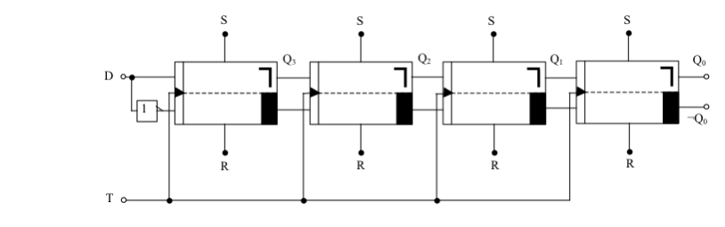

# Schieberegister
Auch bei den sogenannten Schieberegistern finden JK-Flipflops Anwendung. Maßgeblich beteiligt sind dabei nur die Eingänge J und K, der Takteingang T und, wenn erforderlich, der Rücksetzeingang R.

Ein Schieberegister ist so aufgebaut, dass der Taktimpuls an alle Takteingänge gleichzeitig gelegt wird. Es findet also keine Taktteilung statt, sondern alle Flipflops haben den selben Takt. Weiterhin wird jeweils der Q-Ausgang des vorhergehenden Flipflops mit dem J-Eingang des nachfolgenden Flipflops verbunden und der ¬Q-Ausgang mit dem K-Eingang.

Der Dateneingang D dieser Kette wird an den Eingang des ersten Flipflops gelegt und invertiert an den K-Eingang.

Wird bei dieser Schaltung an den Takteingang T ein Impuls gelegt, so wird die gespeicherte Information des Flipflops 3 an die Eingänge des Flipflops 2 weiter “geschoben“. Daher auch der Begriff “Schieberegister“. Die an D angelegten Daten werden also mit jedem Taktimpuls um eine Flipflopstelle weiter nach rechts geschoben. In diesem Beispiel können im Höchstfall 4 Werte in den Flipflops gespeichert werden. Es handelt sich dabei also um ein “4-Bit-Schieberegister“. Ein Bit stellt eine Informationseinheit dar und hat entweder den Wert 0 oder den Wert 1.

Spielen wir nun einmal einen solchen Ablauf durch. An den Dateneingang D wird der Wert 1 gelegt. Wird nun ein Taktimpuls wirksam, so erhält das Flipflop 3 am Ausgang Q3 den Wert 1. Daraufhin wird an D der Wert 0 angelegt. Mit dem nächsten Taktimpuls an T wird der Wert 1 von FF3 an FF2 weitergeschoben; es tritt also an FF2 der Wert 1 am Ausgang auf. Außerdem wird beim selben Taktimpuls der Datenwert 0 vom Eingang D auf das FF3 übernommen, womit am Ausgang Q3 der Wert 0 auftritt. Wird nun an den Eingang D der Wert 1 gelegt und tritt ein erneuter Taktimpuls auf, so erhält der Ausgang Q1 den Wert 1, Q2 erhält den Wert 0 und Q3 den Wert des Dateneingangs vor dem Impuls, also 1. Wird daraufhin an D der Wert 0 gelegt und wird ein neuer Taktimpuls wirksam, so erscheint am Ausgang Q3 der Wert 0, an Q2 der Wert 1, an Q1 der Wert 0 und an Q0 der Wert 1.

Der angelegte Wert von D wird also immer pro Taktimpuls um eine Stelle weiter geschoben.

Die folgende Tabelle zeigt den Sachverhalt der Verschiebung anschaulich. Dabei sind die Informationen, d.h. die Werte 1 oder 0, die an D gelegt werden durch die Variablen a3, a2, a1 und a0 ersetzt. Wichtig dabei ist, dass man zuerst die Daten für a0 eingeben muss, dann die für a1 usw., damit am Ende die Datenreihe a3a2a1a0 erreicht wird. Ein X in der Tabelle bedeutet, dass der Wert an dieser Stelle beliebig ist.

|  t    |    D    |    Q3    |    Q2    |    Q1    |    Q0   |
|-------|---------|----------|----------|----------|---------|
|  0    |  D=a0   |    X     |    X     |    X     |    X    |
|  1    |  D=a1   |    a0    |    X     |    X     |    X    |
|  2    |  D=a2   |    a1    |    a0    |    X     |    X    |
|  3    |  D=a3   |    a2    |    a1    |    a0    |    X    |
|  4    |   X     |    a3    |    a2    |    a1    |    a0   |

Eine weitere Möglichkeit der Eingabe der 4 Daten ist durch die Möglichkeit des Setzens gegeben. Die Daten können nämlich auch durch die Setz- bzw. Rücksetzeingänge eingegeben werden, soweit diese vorhanden sind. Dabei ist ja, wie bekannt, kein Takt nötig.

Falls die Rücksetzeingänge bei einer “Taktsetzung“ (also einer Registrierung der Daten über die J- und K-Eingänge) miteinander verbunden sind, kann damit das ganze Register gelöscht werden. Dies ist von großem Vorteil bei einem Ringschieberegister, das folgend abgebildet ist.

Bei diesem Ringschieberegister ist der Ausgang Q0 mit dem Dateneingang D verbunden. Die Daten werden also in einem Ring weitergeschoben. Dadurch bleiben die einmal gespeicherten Werte die ganze Zeit über gespeichert. Bei einem normalen Schieberegister müsste man ständig bei D neue Daten eingeben, während beim Ringschieberegister die einmal gespeicherten Bits erhalten bleiben und nur ihren Platz wechseln. Die Registrierung der Daten bei einem solchen Ringschieberegister erfolgt zweckmäßigerweise über die Setz- bzw. Rücksetzeingänge. Es ist aber auch eine Registrierung über die J- und K-Eingänge möglich. Nur muss in diesem Fall für die Zeit der Dateneingabe die Verbindung zwischen Q0 und R unterbrochen werden, da Ausgänge generell nicht zusammengeschaltet werden dürfen. Diese Trennung kann z.B. über eine Verknüpfungs­schaltung geschehen.

Um eine Vereinfachung der Schaltung zu erreichen, hat man für das Schieberegister ein Schaltsymbol entworfen, ebenso für das Ring­schieberegister.

An den Takteingang T wird der Takt angelegt. Die Daten werden über den Dateneingang D in die Register a3, a2, a1 und a0 geschoben und können an den Ausgängen Q3, Q2, Q1 und Q0 bzw. ¬Q0 abgegriffen werden. Mit dem Rücksetzeingang R kann das gesamte Register gelöscht werden.

