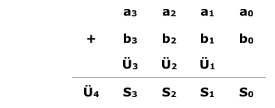

# Volladdierer

Ein Volladdierer ist eine Schaltung, die zwei Dualzahlen zusammenzählt. Dabei beginnt er bei der letzten Stelle, genau so, wie eine Addition “von Hand“ ausgeführt wird. Hier ein kleines Beispiel:

Die Dualzahlen `a3a2a1a0` und `b3b2b1b0` sollen addiert werden.

 

Die Dualzahlen werden untereinander geschrieben. Danach wird die Summe aus a0 + b0 gebildet und der Übertrag Ü1 unter a1 und b1 geschrieben. So läuft die Addition weiter bis zum Übertrag Ü4, der vor die Summen S3 S2 S1 S0 gesetzt wird.

Dabei kann der Volladdierer (VA) nur zwei einstellige Dualzahlen addieren, wodurch ein kleiner Kunstgriff nötig wird um größere Dualzahlen zu addieren. Doch dazu später mehr.

Zuerst stellt sich die Frage: Wie werden Dualzahlen eigentlich addiert? Dabei gelten natürlich genau wie bei der Addition im Dezimalsystem auch bestimmte Regeln. Diese sind in der Logik-Tafel abgebildet. Dabei stellt A eine zu addierende Variable dar, B die andere. Diese beiden Werte A und B werden also zu der Summe S und dem Übertrag Ü zusammengefasst.

|    A    |    B    |    S    |    Ü    |
|---------|---------|---------|---------|
|   0     |    0    |    0    |    0    |
|   0     |    1    |    1    |    0    |
|   1     |    0    |    1    |    0    |
|   1     |    1    |    0    |    1    |

Ein Volladdierer besteht eigentlich aus zwei Halbaddierern, die zwei einstellige Dualzahlen addieren können, jedoch ohne Übertrag. Durch die Zusammenschaltung dieser beiden Halbaddierer ist es möglich, eine Summe samt Übertrag zu bilden. Da die Volladdierer aber als fertige ICs angeboten werden, empfiehlt es sich, diese zu verwenden.

Doch nun zu dem vorher angesprochenen Problem. Wie sieht eine Volladdierer-Schaltung aus, mit der man zwei vierstellige Dualzahlen summieren kann?

Bei diesem Problem hilft uns wiederum das Schieberegister. Wenn man die Register mit den schon gespeicherten Daten an einen VA in der angegebenen Weise anschliesst, so stehen pro Taktimpuls immer nur zwei Werte der beiden Dualzahlen zur Addition zur Verfügung. Es beginnt mit den beiden Werten a0 und b0. Diese werden nun in den VA eingegeben, der sie addiert. Am Ausgang S steht dann die Summe dieser beiden Zahlen und am Ausgang Ü der Übertrag. Bei einem erneuten Taktimpuls gelangen nun die beiden Dualwerte a1 und b1, die ja nach dem letzten Taktimpuls den Platz von a0 und b0 eingenommen haben, an den VA.

Das JK-Flipflop unterhalb der Schieberegister, das vor diesem Taktimpuls den Wert Ü1 am Eingang hatte, hat nun den Wert Ü1 am Ausgang Q. Dieser Ausgang Q ist nun mit einem weiteren Eingang C des VA verbunden. Es liegen also an den Eingängen des Volladdierers die Werte a1 (an A), b1 (an B) und Ü1 an C. Diese werden wiederum addiert und erscheinen als Summe S und als Übertrag Ü an dessen Ausgängen.

Zuvor wurde jedoch der Ausgang S des VA mit dem J-Eingang des Serienaddierers verbunden. Nachdem nun die Summe a0 + b0 gebildet wurde und ein erneuter Taktimpuls die Werte a3, a2 und a1 um eine Stelle weiter nach rechts geschoben hat (ebenso die Werte b3, b2 und b1), sind in den Schieberegistern folgende Werte gespeichert.

    Register A: X,  a3, a2, a1
    Register B: S0, b3, b2, b1
    
In dem JK-Flipflop befindet sich der Übertrag Ü1.

Nun tritt die erneute Addition der Variablen an A, B und C des VA auf. Es wird also die Summe a1 + b1 + Ü1 gebildet. Dabei wird die Summe S1 gebildet, die wiederum am J-Eingang des unteren Schieberegisters anliegt und bei einem erneuten Taktimpuls als Information aufgenommen wird. Der Übertrag Ü2, der bei der Addition entsteht und an den J-Eingang des Flipflops gelegt wird, wird auch von diesem beim nächsten Impuls aufgenommen und erscheint dann am Ausgang Q um von dort bei einer erneuten Addition übernommen zu werden.

Es befinden sich also jetzt folgende Werte in den Registern:

    Register A: X,   X, a3, a2
    Register B: S1, S0, b3, b2
    
In dem JK-Flipflop befindet sich der Übertrag Ü2.
 
Bei einem erneuten Taktimpuls wird die Summe der Werte a2, b2 und Ü2 gebildet. Es erscheint dann am Ausgang S des VA die gebildete Summe S2 und der Übertrag Ü3.

Diese Art der Addition wird so weit fortgesetzt bis sämtliche Variablen addiert sind. Nachdem die letzte Summierung geschehen ist und die letzte Summe in dem unteren Schieberegister abgespeichert wurde, sind die Werte wie folgt in den Registern:

    Register A: X,   X,  X,  X
    Register B: S3, S2, S1, S0

In dem JK-Flipflop befindet sich der Übertrag Ü4.

Der Übertrag Ü4 kann nun aus dem JK-Flipflop entnommen werden und vor die Summe S3, S2, S1, S0 gesetzt werden. Der Sachverhalt der Verschiebung innerhalb des Registers und die Addition der einzelnen Variablen zu einer Summe S und dem Übertrag Ü ist in der folgenden Tabelle noch einmal zusammengefasst.

**Schieberegister A**

|    t    |Stelle 3 |Stelle 2 |Stelle 1| Stelle 0|
|:-------:|:-------:|:-------:|:------:|:-------:|
|   0     |    a3   |    a2   |    a1  |    a0   |
|   1     |    x    |    a3   |    a2  |    a1   |
|   2     |    x    |    x    |    a3  |    a2   |
|   3     |    x    |    x    |    x   |    a3   |
|   4     |    x    |    x    |    x   |    x    |

**Schieberegister B**

|    t    |Stelle 3 |Stelle 2 |Stelle 1| Stelle 0|
|:-------:|:-------:|:-------:|:------:|:-------:|
|   0     |    b3   |    b2   |    b1  |    b0   |
|   1     |    S0   |    b3   |    b2  |    b1   |
|   2     |    S1   |    S0   |    b3  |    b2   |
|   3     |    S2   |    S1   |    S0  |    b3   |
|   4     |    S3   |    S2   |    S1  |    S0   |

**JK-FlipFlop**

|    t    |Stelle 3 |
|:-------:|:-------:|
|   0     |    X    |
|   1     |    Ü1   |
|   2     |    Ü2   |
|   3     |    Ü3   |
|   4     |    Ü4   |

Das obere Schieberegister A, das untere B, das JK-Flipflop und der Volladdierer bilden zusammen eine Einheit. Da diese Schaltung mehrere Variablen, also eine “Serie von Bits“, addieren kann, nennt man diese Schaltung auch einen Serienaddierer.

Der Takt T, der an den beiden Schieberegistern und dem Flipflop liegt muss an den Eingang T angelegt werden. Weiterhin müssen die dualen Zahlen a3a2a1a0 und b3b2b1b0 über die Setz- und Rücksetzeingänge in die Register geladen werden. Diese Eingänge sind hier der Übersicht wegen nicht eingezeichnet.
Wenn die Schaltung aufgebaut und in Betrieb genommen wird, empfiehlt es sich zuerst Einzelimpulse an den Takteingang T zu legen. So kann die Schaltung Schritt für Schritt beobachtet  und kontrolliert werden. Danach ist ein Betrieb mit höherer Taktfrequenz möglich.

