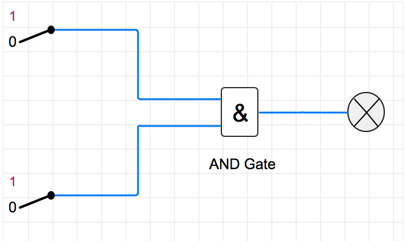
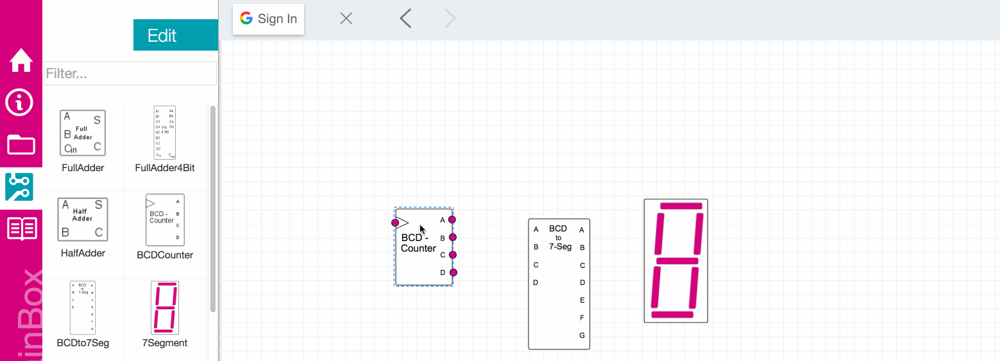
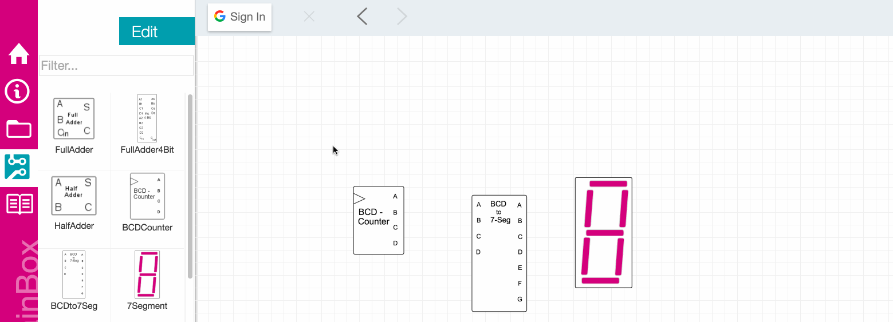
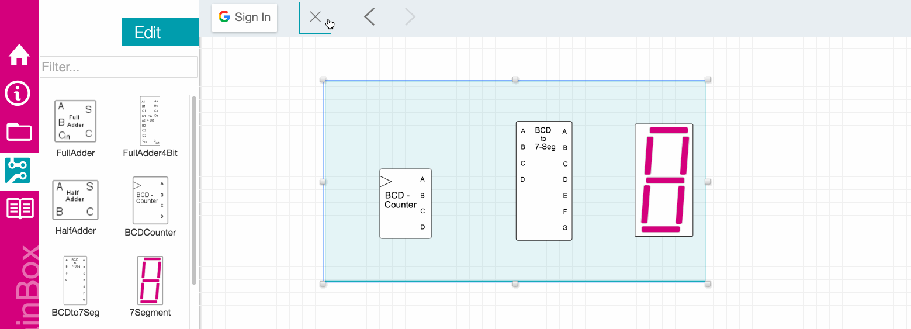
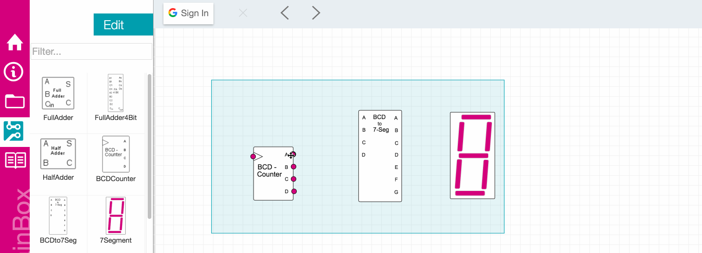

## Brainbox Basics
You can customize and manipulate functional “brains” from any computer’s browser, local or remote.
Every brainbox file consists of nodes which are linked together to form the logical flow of your
application. The nodes typically fall under **input**, **operation** or **output**. 
 
Based on a friendly user interface, the user can interact with its logic blocks, flip switches, change the
input data, connect any device via *wireless communication* modules and watch the output data changes for sequential
models. We are sure that this tool will be of great help to any student who has interest in this field, and enable
him to better understand the logic circuit design process.

Below is a very simple example of how these different nodes would interact with each other.
 
 

## Easy To Use

  **1. Place**
   
  Select an element. Place it on the board.
   
   
  **2. Connect**
   
  Use the Wire Tool to connect your elements.
   
   
  **3. Test**
   
  Click RUN to start the simulation.

   

## Place nodes
brainbox lets you drag and drop components or nodes onto the editing surface and
manipulate them easily with your mouse.
 

### Placing nodes
To add a component to the document, drag it from the left palette on the left side of the window to the
editing surface on the right. Drop it at any location on the editing surface by releasing the left mouse button.

 
 
 
 

### Select single component
To select a **single component** in the document, click it with your mouse. It will be highlighted blue to indicate
that it has been selected.

 
 
 
 

### Select multiple components
Drag and drop is not restricted only to single element. To select a **multiple component** in the document, click
anywhere in the document and drag a bounding box covering all elements to select.

 
 
 
 

### Grouping components
You can group multiple elements if you press the **shift key** during the multiple selection operation. The created *group*
ist more a raft than a closed group.

 
 
 
 

### Delete a node
To delete a node from the document, select it, and then click the Delete button in the upper tool bar. Alternatively,
press either Delete/Entf on your keyboard to delete the selected component. You may also right-click the editing surface
and choose *Delete* from the context menu.

## Connect nodes
Signal is passed around the circuit by connecting nodes with **wires**.

### Create a Connection
To create a connection click a component's output pin (a circular connector, usually on the right side), and drag a
wire to an unconnected input pin. Compatible pins will be highlighted. Input pins may only be connected to a
single output pin. An output pin may be connected to many input pins.

 
 
 
 

## Run the Simulation
*BrainBox* starts simulating when you press the green arrow at the top right corner. The signal will instantly
propagate among the connected components, and if your circuit contains one or more Clocks, they will start
oscillating.

## ...open an example
go to the editor and open your very first example and start the simulation. <a href="../../../../index.html?pane=files_tab" target="_parent">open</a>
 
 
 
 
